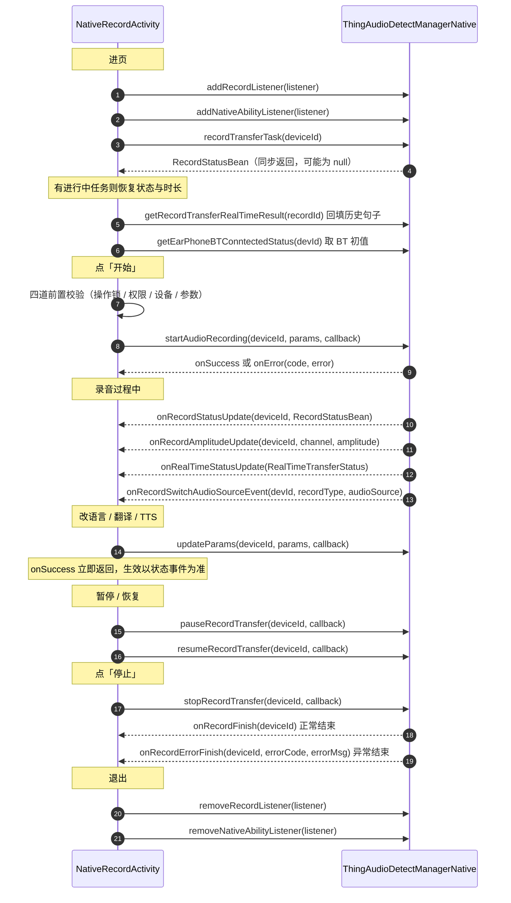

# 模块 1 · 录音控制与设备能力

| 项 | 内容 |
|---|---|
| Demo 页面 | [`NativeRecordActivity`](../../ai_voice/src/main/java/com/tuya/smart/ai_voice/nativeui/NativeRecordActivity.java) |
| 错误码映射 | [`RecordErrorCode`](../../ai_voice/src/main/java/com/tuya/smart/ai_voice/nativeui/widget/RecordErrorCode.java) |
| 全局约定 | [接入指南](./README.md) |

---

## 一、能力概述

录音的完整生命周期：开始、暂停、恢复、停止，以及录音中动态改参、切换收音通道。

设备能力（蓝牙连接状态、电量、信噪比）也在本模块——它们不是独立功能，而是录音流程的组成部分：
蓝牙没连上不能开录，电量与信噪比是录音中的状态提示。

---

## 二、接口清单

| 方法 | 作用 | 回调 |
|---|---|---|
| `recordTransferTask` | 查询进行中的录音任务 | **同步返回** `RecordStatusBean` |
| `startAudioRecording` | 开始录音（可带转写 / 翻译 / TTS） | `IResultCallback` |
| `updateParams` | 录音中动态改参，无需 stop / restart | `IResultCallback` |
| `pauseRecordTransfer` | 暂停 | `IResultCallback` |
| `resumeRecordTransfer` | 恢复 | `IResultCallback` |
| `stopRecordTransfer` | 停止 | `IResultCallback` |
| `switchRecordChannel` | 切换收音通道 | `IResultCallback` |
| `getEarPhoneBTConntectedStatus` | 查询耳机蓝牙连接状态 | `IRecordCallBack<BTConnectedStatus>` |

事件监听：`IRecordListener`（录音核心事件）、`INativeAbilityListener`（设备能力）。

---

## 三、整体时序



---

## 四、接口详解

### `recordTransferTask(String deviceId)`

查询当前设备是否存在进行中的录音任务。**同步返回**，无任务返回 `null`。

| 参数 | 类型 | 必填 | 说明 |
|---|---|---|---|
| `deviceId` | `String` | 是 | 设备 ID；手机本地录音传 `"PHONE"` |

**返回**：[`RecordStatusBean`](#recordstatusbean)，可能为 `null`。

进页必调——它是恢复「切走再切回」场景的唯一途径。实时转写模式下还要接着调
`getRecordTransferRealTimeResult(recordId)`（模块 2）把已转写的句子补回来。

---

### `startAudioRecording(String deviceId, RecordParamsV2 params, IResultCallback callback)`

开始录音。

| 参数 | 类型 | 必填 | 说明 |
|---|---|---|---|
| `deviceId` | `String` | 是 | 设备 ID；手机本地录音传 `"PHONE"` |
| `params` | [`RecordParamsV2`](#recordparamsv2) | 是 | 录音参数，组合方式见[第五节](#五关键约定) |
| `callback` | `IResultCallback` | 否 | `onSuccess` 表示录音已启动；`onError` 的 `code` 见[第七节](#七错误码) |

---

### `updateParams(String deviceId, RecordParamsV2 params, IResultCallback callback)`

录音中动态更新参数（改语言、开关翻译 / TTS），无需 stop / restart。

| 参数 | 类型 | 必填 | 说明 |
|---|---|---|---|
| `deviceId` | `String` | 是 | 设备 ID |
| `params` | [`RecordParamsV2`](#recordparamsv2) | 是 | 新参数。SDK 内部会把 `updateParams` 字段置 `true` |
| `callback` | `IResultCallback` | 否 | **`onSuccess` 立即返回，不等底层结果** |

> `onSuccess` 只表示请求已下发。参数真正生效以 `onRecordStatusUpdate` 推送的
> `RecordStatusBean` 为准，界面不要在 `onSuccess` 里就宣告改参成功。

---

### `pauseRecordTransfer` / `resumeRecordTransfer` / `stopRecordTransfer`

```java
void pauseRecordTransfer(String deviceId, IResultCallback callback)
void resumeRecordTransfer(String deviceId, IResultCallback callback)
void stopRecordTransfer(String deviceId, IResultCallback callback)
```

| 参数 | 类型 | 必填 | 说明 |
|---|---|---|---|
| `deviceId` | `String` | 是 | 设备 ID |
| `callback` | `IResultCallback` | 否 | 结果回调 |

停止的**真正结束以 `onRecordFinish` / `onRecordErrorFinish` 事件为准**，
`stopRecordTransfer` 的 `onSuccess` 只代表停止指令已下发。

---

### `switchRecordChannel(String deviceId, int recordChannel, IResultCallback callback)`

切换收音通道。

| 参数 | 类型 | 必填 | 说明 |
|---|---|---|---|
| `deviceId` | `String` | 是 | 设备 ID |
| `recordChannel` | `int` | 是 | `0` 未指定 / `1` BT（耳机）/ `2` Micro（手机麦） |
| `callback` | `IResultCallback` | 否 | 结果回调 |

> AI 笔记小程序中定义了该接口却从未调用，流程未经业务验证。

---

### `getEarPhoneBTConntectedStatus(String devId, IRecordCallBack<BTConnectedStatus> callback)`

查询耳机蓝牙连接状态。

| 参数 | 类型 | 必填 | 说明 |
|---|---|---|---|
| `devId` | `String` | 是 | 设备 ID。手机本地录音无蓝牙概念，无需调用 |
| `callback` | `IRecordCallBack<BTConnectedStatus>` | 否 | 返回 [`BTConnectedStatus`](#btconnectedstatus) |

进页取一次初值，后续变化由 `INativeAbilityListener.onBTConnectChange` 推送。

---

### 事件监听

#### `IRecordListener`

```java
manager.addRecordListener(listener);      // 进页
manager.removeRecordListener(listener);   // 退出，传同一实例
```

| 回调 | 说明 |
|---|---|
| `onRecordStatusUpdate(String deviceId, RecordStatusBean bean)` | 录音状态变更。**只在状态变化时推送**，界面计时需本地自增 |
| `onRecordAmplitudeUpdate(String deviceId, int channel, double amplitude)` | 振幅更新，用于画波形。高频回调，需自行节流 |
| `onRealTimeStatusUpdate(RealTimeTransferStatus status)` | 实时转写推送，见 [`RealTimeTransferStatus`](#realtimetransferstatus) |
| `onRecordSwitchAudioSourceEvent(String devId, int recordType, int audioSource)` | 音源被切换 |
| `onRecordFinish(String deviceId)` | 录音正常结束 |
| `onRecordErrorFinish(String deviceId, int errorCode, String errorMsg)` | 录音异常结束，`errorCode` 见[第七节](#七错误码) |

#### `INativeAbilityListener`

```java
manager.addNativeAbilityListener(listener);
manager.removeNativeAbilityListener(listener);
```

| 回调 | 参数 | 说明 |
|---|---|---|
| `onBTConnectChange(BTConnectedStatus status)` | [`BTConnectedStatus`](#btconnectedstatus) | 耳机蓝牙连接状态变化 |
| `onPhoneBatteryChange(PhoneBatteryInfo info)` | [`PhoneBatteryInfo`](#phonebatteryinfo) | 设备电量变化 |
| `onRecordQualityChange(RecordQualityInfo info)` | [`RecordQualityInfo`](#recordqualityinfo) | 录音信噪比变化 |

---

## 五、数据结构

### `RecordParamsV2`

录音参数，`startAudioRecording` / `updateParams` 的入参。

| 字段 | 类型 | 默认 | 说明 |
|---|---|---|---|
| `updateParams` | `Boolean` | `false` | 是否为「更新参数」。调 `updateParams` 时 SDK 内部置 `true`，调用方无需设置 |
| `audioSource` | `Integer` | `null` | 音频输入源，取值见下表。**必须与 `audioSourceList` 同时设置** |
| `audioSourceList` | `List<Integer>` | `null` | 多路音频源。底层按 `audioSourceList[0]` 取录音类型，为空会导致启动失败 |
| `recordMode` | `Integer` | `null` | `0` 电话 / `1` 现场（会议）/ `2` 面对面 |
| `f2fChannel` | `Integer` | `null` | 面对面通道：`0` 默认 / `1` 左 / `2` 右。仅 `recordMode=2` 时有效 |
| `needAsr` | `boolean` | `false` | 是否开启实时转写 |
| `needTranslate` | `boolean` | `false` | 是否开启翻译。为 `true` 时 `targetLanguage` 必填 |
| `needTts` | `boolean` | `false` | 是否把译文合成语音播回。为 `true` 时需设置 `ttsConfig` |
| `needAmplitude` | `boolean` | `false` | 是否推送振幅回调。不画波形时关掉可省电 |
| `originalLanguage` | `String` | `null` | 源语言，如 `"zh"`。开启 ASR 或翻译时必填 |
| `targetLanguage` | `String` | `null` | 目标语言，如 `"en"`。开启翻译时必填 |
| `agentId` | `String` | `null` | 智能体 / 渠道 ID |
| `ttsEncode` | `Integer` | `null` | TTS 流编码方式，`ttsConfig.encode` 的兼容字段 |
| `recordTransfer3AConfig` | [`Audio3AConfig`](#audio3aconfig) | `null` | 3A 音频处理配置。不设置时由底层按设备能力决定 |
| `ttsConfig` | [`TTSConfig`](#ttsconfig) | `null` | TTS 输出配置。与 `ttsConfigList` 互为兜底，SDK 会自动补齐另一个 |
| `ttsConfigList` | `List<TTSConfig>` | `null` | 多输出源 TTS 配置 |
| `businessType` | `Integer` | `null` | `0` AI Note / `1` AI Translate |
| `autoRecognize` | `Boolean` | `null` | 是否自动识别语种。置 `true` 后 `originalLanguage` 可不传 |
| `startLivingStatus` | `int` | `0` | 直播场景状态机：`0` 仅同传 / `1` 开始直播 / `2` 直播中变更 |

**`audioSource` 取值**

| 值 | 含义 |
|---|---|
| `0` | 系统蓝牙 16K 单声道 |
| `1` | 系统 MIC 16K 单声道 |
| `20` | Pro 耳机 16K 单声道 |
| `21` | Pro 耳机 16K 双声道 |
| `22` | Pro 耳机 32K 单声道 |
| `40` | 卡片 16K 单声道 |
| `41` | 卡片 16K 双声道 |

### `Audio3AConfig`

3A 音频处理配置，嵌套于 `RecordParamsV2`。

| 字段 | 类型 | 默认 | 说明 |
|---|---|---|---|
| `ansEnable` | `boolean` | 由底层决定 | 降噪开关 |
| `ansLevel` | `int` | `1` | 降噪等级 |
| `agcEnable` | `boolean` | 由底层决定 | 自动增益开关 |
| `aecEnable` | `boolean` | 由底层决定 | 回声消除开关 |

### `TTSConfig`

TTS 输出配置，嵌套于 `RecordParamsV2`。构造参数全部必填。

| 字段 | 类型 | 说明 |
|---|---|---|
| `devId` | `String` | 输出到设备时传设备 ID；**走系统通道（MIC / 蓝牙）时必须传空串**，否则底层会尝试往设备写流 |
| `output` | `TTSOutput` | 输出源，取值见下 |
| `encode` | `TTSEncode` | 编码方式，取值见下 |
| `channel` | `TTSOutputChannel` | 输出通道，取值见下 |

| 枚举 | 取值 |
|---|---|
| `TTSOutput` | `DEFAULT` 不开启 / `SYSTEM_MIC` 手机扬声器 / `SYSTEM_BLUETOOTH` 系统蓝牙 / `DEVICE` 设备 |
| `TTSEncode` | `DEFAULT` / `OPUS_SILK`（Pro 耳机）/ `OPUS_CELT`（特定固件） |
| `TTSOutputChannel` | `DEFAULT` 双耳 / `CHANNEL_LEFT` 左耳 / `CHANNEL_RIGHT` 右耳 |

`output` 由音源反推：系统 MIC 音源配 `SYSTEM_MIC`，系统蓝牙音源配 `SYSTEM_BLUETOOTH`，
Pro / 卡片等设备音源配 `DEVICE`。

### `RecordStatusBean`

录音状态。`recordTransferTask` 的返回值，也是 `onRecordStatusUpdate` 的回调参数。

| 字段 | 类型 | 说明 |
|---|---|---|
| `status` | `int` | `0` 待开始 / `1` 录音中 / `2` 暂停 / `3` 结束 |
| `duration` | `long` | 已录时长（毫秒） |
| `type` | `Integer` | 录音类型：`0` 电话 / `1` 会议 |
| `transferType` | `Integer` | 转写模式：`0` 文件转写 / `1` 实时转写 |
| `needTranslate` | `Boolean` | 是否开启了翻译 |
| `originalLanguage` | `String` | 源语言 |
| `targetLanguage` | `String` | 目标语言 |
| `currentRealTimeAsrId` | `String` | 当前实时转写句 ID |
| `recordId` | `String` | 实时转写记录 ID，恢复历史句子时用它 |
| `devId` | `String` | 设备 ID |
| `audioSource` | `Integer` | 实际使用的音频源 |
| `needTts` | `Boolean` | 是否开启了 TTS |
| `businessType` | `Integer` | `0` AI Note / `1` AI Translate |

### `RealTimeTransferStatus`

实时转写事件，`onRealTimeStatusUpdate` 的回调参数。

| 字段 | 类型 | 说明 |
|---|---|---|
| `deviceId` | `String` | 设备 ID |
| `recordId` | `String` | 实时转写记录 ID |
| `requestId` | `String` | 请求 ID |
| `asrId` | `Long` | 单句 ID。同一句的多次推送 `asrId` 相同 |
| `channel` | `Integer` | 声道：会议恒 `0`；电话 `0` 近端 / `1` 远端；同传 `0` 左 / `1` 右 |
| `phase` | `Integer` | 阶段：`0` 任务 / `1` asr / `2` text / `3` skill / `4` tts |
| `status` | `Integer` | 阶段状态：`0` 未开启 / `1` 进行中 / `2` 结束 / `3` 取消 |
| `text` | `String` | 识别文本。**是累积文案不是增量**，直接覆盖当前句即可 |
| `beginOffset` | `Long` | 该句起始偏移（毫秒） |
| `endOffset` | `Long` | 该句结束偏移（毫秒） |
| `translateText` | `String` | 翻译文本，同样是累积文案 |
| `translateStatus` | `Integer` | 翻译状态 |
| `errorCode` | `Integer` | 错误码 |
| `errorMessage` | `String` | 错误消息 |

> 译文（`phase` 为文本阶段）可能**晚于该句定稿**才到达，
> 因此要写进「最后一句」而不是「当前句」，否则译文会丢。

### `BTConnectedStatus`

| 字段 | 类型 | 说明 |
|---|---|---|
| `devId` | `String` | 设备 ID |
| `connectedStatus` | `int` | `1` 已连接 / `0` 未连接 |

### `PhoneBatteryInfo`

| 字段 | 类型 | 说明 |
|---|---|---|
| `needShow` | `boolean` | 是否需要展示。为 `false` 时不要显示电量 |
| `batteryValue` | `double` | 电量百分比 |

### `RecordQualityInfo`

| 字段 | 类型 | 说明 |
|---|---|---|
| `needShow` | `boolean` | 是否需要展示 |
| `snrValue` | `double` | 信噪比（dB） |

---

## 六、关键约定

### 录音模式决定参数组合

选错组合会导致「录了但没转写」或「白白开着 ASR 费流量」：

| 模式 | `recordMode` | `needAsr` | `needTranslate` | 备注 |
|---|---|---|---|---|
| 现场录音 | `1` | `false` | `false` | 只录音不转写 |
| 电话录音 | `0` | `false` | `false` | 需先进入通话 |
| 实时转写 | `1` | `true` | `false` | |
| 同声传译 | `1` | `true` | `true` | 需 `targetLanguage`，可选 `needTts` |

### `audioSource` 按设备类型推导

它不是固定值，由**设备类型 + 是否电话模式**共同决定：

| 设备 | `audioSource` |
|---|---|
| 手机 | `1` 系统 MIC |
| 入门耳机 / OS 耳机 | `0` 系统蓝牙 |
| Pro 耳机 | 非电话 `20`，电话 `21` |
| 录音卡片 | `41` |

> 取错音源会直接录不出声。另外底层读的是 `audioSourceList[0]`，
> 所以 `audioSource` 与 `audioSourceList` **必须同时设置**。

### 发起前的五道校验

| 校验 | 说明 |
|---|---|
| 操作锁 | 开始 / 暂停 / 恢复 / 停止都是异步生效，连点会重复下发。建议锁定约 1 秒 |
| 录音权限 | `RECORD_AUDIO`，被永久拒绝时需引导去系统设置 |
| 设备在线 | 离线设备开录必然失败 |
| 蓝牙连接 | 选了真实耳机但 BT 未连接（`connectedStatus == 0`）时拦截 |
| 参数完整 | 开 ASR / 翻译必须有 `originalLanguage`；开翻译必须有 `targetLanguage` |

停止还有一道：**仅在录音中或暂停中允许**，其余状态直接忽略。

---

## 七、错误码

录音链路的错误码集中在 `10001`~`10101`，语义细分较多，
需按码给提示而不是把底层 `errorMsg` 直接抛给用户。

| 码 | 含义 |
|---|---|
| `9006` | 当前网络不可用 |
| `10001` / `10100` / `10101` | 服务繁忙 |
| `10002` / `10063` | 设备不支持这个操作 |
| `10011` | 网络连接异常 |
| `10021` | 服务超时，录音已暂停 |
| `10031` / `10032` | 无法创建文件，检查存储空间或权限 |
| `10033` | 删除失败 |
| `10041` | 操作未成功 |
| `10042` / `10047` | 已经在录音了 |
| `10043` | 已经暂停录音了 |
| `10044` | 已经恢复录音了 |
| `10045` / `10048` | 已经停止录音了 |
| `10046` | 正在处理中 |
| `10049` | 恢复录音失败 |
| `10050` | 当前手机处于通话中，无法录音 |
| `10061` | 设备在录音或异常状态（**电话录音模式下含义不同，见下**） |
| `10062` | 当前设备不支持录音控制 |
| `10064` | 部分设备未连接 |
| `10071` / `10072` / `10073` | 录音失败 |
| `10081` | 余额不足，需购买流量包或订阅 |
| `10082` | 蓝牙连接失败 |
| `10083` | 设备已离线 |
| `39001`~`39012` | AI 基座错误，整段统一提示「服务繁忙」，不逐个区分 |

### `10061` 的两种含义

同一个码在不同模式下语义不同，**必须结合当前模式判断**：

| 场景 | 含义 | 提示 |
|---|---|---|
| 电话录音模式 | 尚未进入通话 | 电话录音需先进入通话 |
| 其余模式 | 设备在录音或异常状态 | 请确认设备状态后重新开启 |

`onRecordErrorFinish` 的 `errorCode` 同样走这张表。

---

## 八、接入清单

1. `addRecordListener` / `addNativeAbilityListener` 成对注册与注销，**传同一实例**
2. 进页调 `recordTransferTask(deviceId)` 恢复进行中的任务。
   实时转写模式还要调 `getRecordTransferRealTimeResult(recordId)` 把已转写的句子补回来，
   否则界面上是空白的
3. 模式决定参数组合，`audioSource` 按设备类型推导，
   `audioSource` 与 `audioSourceList` 同时设置
4. 控制类操作加锁防连点；停止前判状态
5. `updateParams` 的 `onSuccess` 立即返回，**不代表参数已生效**，
   真正生效以 `onRecordStatusUpdate` 为准
6. 状态事件只在状态变化时推送，界面上的计时需本地自增，
   收到事件时用其 `duration` 校准
7. 错误提示按码映射，注意 `10061` 在电话录音模式下的特殊含义

---

## 附：本模块未覆盖的能力

| 能力 | 说明 |
|---|---|
| 面对面翻译（`recordMode=2` + `f2fChannel`） | 属于 AI Translate 业务，本 Demo 不实现 |
| `Audio3AConfig` / `autoRecognize` / `startLivingStatus` | AI 笔记小程序未使用，字段说明见[第五节](#五数据结构) |
