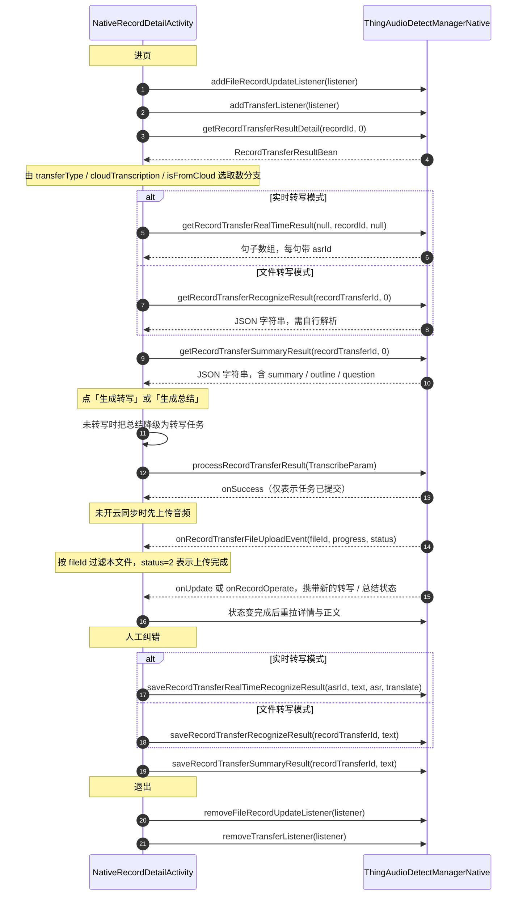
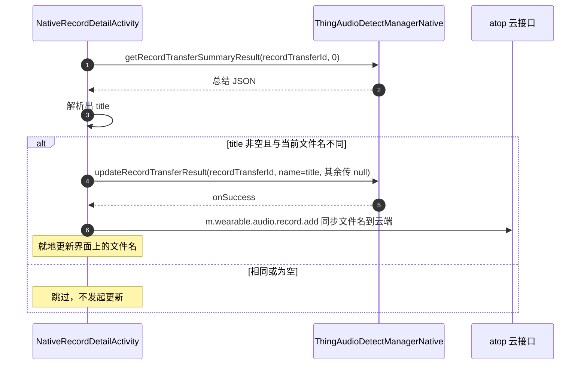

# 模块 2 · 转写 / 总结

| 项 | 内容 |
|---|---|
| Demo 页面 | [`NativeRecordDetailActivity`](../../ai_voice/src/main/java/com/tuya/smart/ai_voice/nativeui/NativeRecordDetailActivity.java) |
| 错误码映射 | [`RecordErrorCode`](../../ai_voice/src/main/java/com/tuya/smart/ai_voice/nativeui/widget/RecordErrorCode.java) |
| 全局约定 | [接入指南](./README.md) |

---

## 一、能力概述

把已有录音转成文字并生成总结，以及对结果做人工纠错。

转写正文有**两种存储形态**（实时逐句 / 文件整份），取数与保存都要分支处理，
走错分支会拿到空内容——这是本模块最容易踩的地方。

---

## 二、接口清单

| 方法 | 作用 | 回调 |
|---|---|---|
| `processRecordTransferResult` | 发起转写 / 总结任务 | `IResultCallback` |
| `getRecordTransferRecognizeResult` | 查询转写正文（文件转写模式） | `IRecordCallBack<String>` |
| `saveRecordTransferRecognizeResult` | 保存转写正文（整份覆盖） | `IResultCallback` |
| `getRecordTransferSummaryResult` | 查询总结正文 | `IRecordCallBack<String>` |
| `saveRecordTransferSummaryResult` | 保存总结正文 | `IResultCallback` |
| `getRecordTransferRealTimeResult` | 查询实时转写句列表 | `IRecordCallBack<List<RecordTransferRealTimeResult>>` |
| `saveRecordTransferRealTimeRecognizeResult` | 按 `asrId` 保存单句 | `IResultCallback` |

事件监听：`ITransferListener`（音频上传进度）、`IRecordFileUpdateCallback`（转写 / 总结状态变化，见[模块 3](./module-03-file-management.md#事件监听)）。

---

## 三、整体时序



---

## 四、接口详解

### `processRecordTransferResult(TranscribeParam param, IResultCallback callback)`

发起转写 / 总结 / 翻译任务。

| 参数 | 类型 | 必填 | 说明 |
|---|---|---|---|
| `param` | [`TranscribeParam`](#transcribeparam) | 是 | 任务参数 |
| `callback` | `IResultCallback` | 否 | **`onSuccess` 仅表示任务已提交，不是完成** |

完成状态由 `IRecordFileUpdateCallback` 推送，不要轮询。

---

### `getRecordTransferRecognizeResult(long recordTransferId, int from, IRecordCallBack<String> callback)`

查询转写正文。**文件转写模式**使用。

| 参数 | 类型 | 必填 | 说明 |
|---|---|---|---|
| `recordTransferId` | `long` | 是 | 文件 ID |
| `from` | `int` | 是 | ⚠️ **已废弃，传任意值均可**（约定传 `0`）。见下方说明 |
| `callback` | `IRecordCallBack<String>` | 否 | 返回值是 **JSON 字符串**，需自行解析 |

返回的 JSON 是数组，元素形如 `{transcript, translation, timeOffset, speaker}`。
`timeOffset` 可能是毫秒数（`"1000"`）也可能带秒后缀（`"1s"`），解析时需兼容两种。

> ⚠️ **`from` 参数已废弃。** 底层实现里它没有参与任何判断——
> 取数逻辑固定为「**先查本地库，查不到或失败自动回退云端**」，
> 不需要也无法由调用方指定来源。参数保留只为兼容既有签名，**约定传 `0`**。
> 同样的情况见 `getRecordTransferSummaryResult`。

---

### `saveRecordTransferRecognizeResult(long recordTransferId, String text, IResultCallback callback)`

保存转写正文，**整份覆盖**。文件转写模式使用。

| 参数 | 类型 | 必填 | 说明 |
|---|---|---|---|
| `recordTransferId` | `long` | 是 | 文件 ID |
| `text` | `String` | 是 | 完整的转写 JSON 字符串，格式与查询返回一致 |
| `callback` | `IResultCallback` | 否 | 结果回调 |

---

### `getRecordTransferSummaryResult(long recordTransferId, int from, IRecordCallBack<String> callback)`

查询总结正文。参数与 `getRecordTransferRecognizeResult` 相同，
**`from` 同样已废弃**，约定传 `0`。

返回的 JSON 是对象，形如 `{summary, outline, question, title, imageUrl}`。
**`outline` 与 `question` 本身是二次编码的 JSON 字符串**，要再解析一次。

---

### `saveRecordTransferSummaryResult(long recordTransferId, String text, IResultCallback callback)`

保存总结正文，**整份覆盖**。参数形态与 `saveRecordTransferRecognizeResult` 相同。

> ⚠️ **不要把界面上的展示文本直接存回去。** 总结是一个 JSON 对象
> （`summary` / `outline` / `question` / `title`），而界面上通常展示的是把这几段拼起来的
> 可读文本。整份覆盖会把除正文外的字段全部抹掉，下次解析只能退化成纯文本，
> 思维导图、AI 标题这些依赖 `outline` / `title` 的功能一并失效。

正确做法是**只让用户编辑 `summary` 字段**，保存时写回原 JSON：

```java
// 展示：只取 summary 正文
String body = JSON.parseObject(rawJson).getString("summary");

// 保存：写回原 JSON，其余字段原样保留
JSONObject obj = JSON.parseObject(rawJson);
obj.put("summary", editedBody);
manager.saveRecordTransferSummaryResult(recordTransferId, obj.toJSONString(), callback);
```

Demo 中的实现见 [`TransferTextParser.parseSummaryBody` / `writeSummaryBody`](../../ai_voice/src/main/java/com/tuya/smart/ai_voice/nativeui/widget/TransferTextParser.java)。

---

### `getRecordTransferRealTimeResult(String fileId, String recordId, String asrId, IRecordCallBack<List<RecordTransferRealTimeResult>> callback)`

查询实时转写句列表。**实时转写模式**使用。

| 参数 | 类型 | 必填 | 说明 |
|---|---|---|---|
| `fileId` | `String` | 否 | 按文件 ID 过滤；不过滤传 `null` |
| `recordId` | `String` | 否 | 按实时转写记录 ID 过滤；这是最常用的查询方式 |
| `asrId` | `String` | 否 | 按单句 ID 过滤；查单句时用 |
| `callback` | `IRecordCallBack<List<RecordTransferRealTimeResult>>` | 否 | 返回 [`RecordTransferRealTimeResult`](#recordtransferrealtimeresult) 列表 |

三个过滤参数**全部可为 `null`**，传 `null` 表示该维度不过滤。常规用法是只传 `recordId`。

除详情页外，[模块 1](./module-01-record-control.md) 的录音页恢复场景也要调它——
进页时若有实时转写任务在跑，需用它把已转写的句子补回界面。

---

### `saveRecordTransferRealTimeRecognizeResult(long asrId, String text, String asr, String translate, IResultCallback callback)`

按 `asrId` 更新实时转写的**单句**。

| 参数 | 类型 | 必填 | 说明 |
|---|---|---|---|
| `asrId` | `long` | 是 | 单句 ID，取自 `RecordTransferRealTimeResult.asrId` |
| `text` | `String` | 否 | 展示文案；`null` 表示不修改 |
| `asr` | `String` | 否 | 原始 ASR 文案；`null` 表示不修改 |
| `translate` | `String` | 否 | 译文；`null` 表示不修改 |
| `callback` | `IResultCallback` | 否 | 结果回调 |

---

### 事件监听

#### `ITransferListener`

```java
manager.addTransferListener(listener);
manager.removeTransferListener(listener);
```

| 回调 | 说明 |
|---|---|
| `onRecordTransferFileUploadEvent(String fileId, int progress, int status)` | 音频上传进度 |

三个参数都是原子类型，没有包装 Bean：

| 参数 | 类型 | 说明 |
|---|---|---|
| `fileId` | `String` | 文件 ID 的字符串形式。**事件是全局广播的，必须按它过滤出本文件** |
| `progress` | `int` | 进度 `0`~`100` |
| `status` | `int` | `0` 等待上传 / `2` 上传完成 |

> **为什么转写前会有上传**：未开启云同步时音频还在本地，转写 / 总结前底层要先把音频传到云端。
> 上传完成后状态随即进入「转写中」。

---

## 五、数据结构

### `TranscribeParam`

转写 / 总结任务的入参。

| 字段 | 类型 | 必填 | 说明 |
|---|---|---|---|
| `fileId` | `Long` | 是 | 文件 ID，即 `recordTransferId` |
| `template` | `String` | 否 | **总结模板 ID**，不是模板名也不是模板内容。留空（`""`）用智能推荐 |
| `transferType` | `Integer` | 是 | **任务类型**，取值同 `TaskTypeDef`：`0` 转写 / `1` 总结 / `2` 翻译。别与 `RecordTransferResultBean.transferType`（转写模式）混淆，同名不同义 |
| `audioLang` | `String` | 否 | ASR 语言，取录音的 `originalLanguage`；留空由底层判定 |
| `transLang` | `String` | 否 | 翻译目标语言。仅 `transferType=2` 时需要 |
| `summaryLang` | `String` | 否 | 总结输出语言。留空即不指定，由底层决定 |
| `enableSpeaker` | `boolean` | 否 | 是否开启说话人分离 |
| `ownerId` | `String` | 否 | 家庭 ID。语义是数字但类型为 `String` |
| `devId` | `String` | 否 | 录音所属设备的 ID |
| `key` | `String` | 否 | 业务 `recordId` |
| `objectKey` | `String` | 否 | 对象存储 key |
| `duration` | `Integer` | 否 | 音频时长 |
| `channelMode` | `String` | 否 | 声道模式，取值同 `ChannelModeDef`：`"single"` 单声道 / `"multi"` 多声道 |

构造顺序：`(fileId, template, transferType, audioLang, transLang, summaryLang, enableSpeaker)`。

其余 6 个字段（`ownerId` 起）不在构造函数里，需用 setter 设置；
**通常不必设置**，底层会按 `fileId` 自行补齐。

### `RecordTransferRealTimeResult`

实时转写的单句，`getRecordTransferRealTimeResult` 返回列表的元素。

| 字段 | 类型 | 说明 |
|---|---|---|
| `asrId` | `Long` | 单句 ID。保存纠错时按它定位 |
| `recordTransferId` | `Long` | 所属文件 ID |
| `beginOffset` | `Long` | 该句起始偏移（毫秒），用于展示时间戳 |
| `endOffset` | `Long` | 该句结束偏移（毫秒） |
| `text` | `String` | 展示文案。为空时回退用 `asr` |
| `asr` | `String` | 原始 ASR 文案 |
| `translate` | `String` | 译文 |
| `requestId` | `String` | 请求 ID |
| `recordId` | `String` | 实时转写记录 ID |
| `channel` | `Integer` | 声道：会议恒 `0`；电话 `0` 近端 / `1` 远端；同传 `0` 左 / `1` 右 |
| `status` | `Integer` | 转录状态：`0` 未开始或进行中 / `1` 成功 / `2` 失败 |
| `businessType` | `int` | `0` AI Note / `1` AI Translate |
| `ttsPath` | `String` | TTS 音频路径 |

---

## 六、关键约定

### 正文取数的两条分支

转写正文有两种存储形态，**走错分支会拿到空内容**：

| 条件 | 接口 | 返回形态 |
|---|---|---|
| `transferType == 1`（实时）且 `!cloudTranscription` 且 `!isFromCloud` | `getRecordTransferRealTimeResult(recordId)` | 句子数组，每句带 `asrId` / `beginOffset` / `channel` |
| 其余（文件转写完成 / 云端转录 / 云同步下来的记录） | `getRecordTransferRecognizeResult(recordTransferId)` | JSON 字符串，需自行解析 |

三个判据缺一不可：云端转录与云同步来的记录即使原本是实时转写，正文也已经落成 JSON。

保存同样分两条，**且与取数分支必须一致**：

| 模式 | 保存方式 |
|---|---|
| 实时转写 | 逐句 `saveRecordTransferRealTimeRecognizeResult(asrId, ...)`，按 `asrId` 定位 |
| 文件转写 | 整份 `saveRecordTransferRecognizeResult(recordTransferId, text)` |

### `save*` 只写本地，跨端可见要另调云端

三个 `save*` 接口写的都是**本地**。人工纠错要跨端可见，还得再调一次业务云的编辑接口——
这部分不是 SDK 能力，需接入方自行补上。**这是接入时最容易漏的一环**：
本地存成功了、界面也刷新了，换台设备打开却还是旧内容。

| atop 接口 | 用途 | 入参 | Demo |
|---|---|---|---|
| `m.wearable.audio.summary.edit` | 总结正文编辑 | `key`（= `recordId`）、`content` | ✔ 已实现 |
| `m.wearable.audio.content.edit` | 转写正文编辑 | `devId`、`key`（= `recordId`）、`content` | ✔ 已实现 |

两点注意：

- **`content` 必须与写本地时是同一份 JSON 字符串**，不能是界面上的展示文案，
  否则云端结构会被破坏（同[上一节](#saverecordtransfersummaryresultlong-recordtransferid-string-text-iresultcallback-callback)的道理）
- 定位用的是业务 `recordId`，但参数名叫 **`key`**

失败处理建议**不回滚本地**：本地已经改好，回滚等于丢掉用户的编辑；
提示一句「云端未同步」比悄悄还原更诚实。

总结、转写、文件名三者都应本地 + 云端**双写**，Demo 已全部对齐
（另含已读状态），实现见
[`AudioContentBusiness`](../../ai_voice/src/main/java/com/tuya/smart/ai_voice/nativeui/business/AudioContentBusiness.java)。

### 编辑正文必须留一份原始结构

`saveRecordTransferRecognizeResult` 是**整份覆盖**写入，而界面上展示的通常是
把 JSON 拼成的可读文案（时间戳、说话人、译文）。**那份文案无法反解回结构**——
直接存回去，`timeOffset` / `speaker` / `translation` 全部丢失。

正确做法是取数时另留一份原始数组，编辑只改对应段落的 `transcript`，再整份提交：

```java
// 取数：展示用可读文案，另存一份原始数组
JSONArray origin = JSON.parseArray(text);
textView.setText(renderReadable(origin));

// 保存：只替换该段的 transcript，其余字段与其余段落原样保留
origin.getJSONObject(index).put("transcript", newText);
manager.saveRecordTransferRecognizeResult(recordTransferId, origin.toJSONString(), cb);
```

这也决定了**交互形态**：编辑必须以「段」为单位（点某段 → 改这一段），
不能给一个大输入框让用户自由编辑整篇 —— 一旦增删了行，段落数就与原数组对不上，
按序号映射即告失效。

同理，总结的 `summary` 字段可以整块编辑，是因为它本来就是单个字符串字段，
不存在分段映射问题。

调用范式参考 Demo 里已有的
[`AudioContentBusiness`](../../ai_voice/src/main/java/com/tuya/smart/ai_voice/nativeui/business/AudioContentBusiness.java)
（它目前实现的是改名与已读标记，正文编辑可照同样写法追加）：

```java
private static final String API_CONTENT_EDIT = "m.wearable.audio.content.edit";
private static final String API_VERSION = "1.0";

/** 保存转写正文到云端。仅文件转写模式需要调用。 */
public void editContent(String devId, String recordId, String content,
                        ResultListener<Boolean> listener) {
    ApiParams apiParams = new ApiParams(API_CONTENT_EDIT, API_VERSION);
    apiParams.setSessionRequire(true);
    apiParams.putPostData("devId", devId);
    apiParams.putPostData("key", recordId);
    apiParams.putPostData("content", content);
    asyncRequest(apiParams, Boolean.class, listener);
}
```

四点容易踩：

- **转写编辑要传 `devId`，总结编辑不传**
- 两者都用业务 `recordId`（参数名是 `key`）定位，**不是 `recordTransferId`**
- 只有**文件转写**模式需要写云端。实时转写按句存储，该模式下只逐句写本地
- 云端失败不必回滚本地——本地已保存成功，提示用户「跨端不可见」即可

### 未转写时总结要降级为转写

总结以转写结果为输入。`transfer == 0`（未转写）时下发 `transferType=1`
不会产出任何东西，必须降级成 `transferType=0`。

降级不会让用户少拿东西——**转写任务本身就会连带产出总结**。

### 转写与总结的状态取值不对齐

| 状态 | `transfer`（转写） | `summary`（总结） |
|---|---|---|
| 未开始 | `0` | `1`（`0` 为兼容老数据） |
| 进行中 | `1` | `2` |
| 已完成 | `2` | `3` |
| 失败 | `3` | `4` |

> 判断「是否正在处理」时不能共用同一个常量，转写是 `1`、总结是 `2`。

### 任务提交后的三段式

`processRecordTransferResult` 的 `onSuccess` **只表示任务已提交**。之后：

1. 未开云同步时，底层先上传音频，进度由 `ITransferListener` 推送
   （`status` 为 `0` 等待 / `2` 完成，需按 `fileId` 过滤本文件）
2. 上传完成后进入转写，完成状态由 `IRecordFileUpdateCallback` 推送
3. 状态变为完成时再重拉正文，**不要轮询**

### 总结标题回写文件名

总结 JSON 里除正文外还带一个 `title`——AI 为这条录音提炼的标题。
录音刚生成时文件名多是时间戳之类的默认值，总结完成后用它替换，列表里才好辨认。



三点须注意：

- 改名走的是**模块 3** 的 `updateRecordTransferResult`，其余可选参数传 `null` 表示不修改
- **必须先比对再改**。总结每次重新加载都会走到这里，不比对就会反复发起无意义的更新
- 文件名共存三份（本地库、云端、总结 JSON 的 `title`），**这条路径只需写前两份**——
  `title` 本就是从总结里读出来的，无需回写。手动改名则三处都要写，
  详见[模块 3 · 重命名要写三处](./module-03-file-management.md#重命名要写三处)

---

## 七、错误码

**本模块没有专属错误码**，失败走录音链路的通用码表
（`9006`、`10001`~`10101`、AI 基座 `39001`~`39012`），
明细见 [模块 1 · 错误码](./module-01-record-control.md#七错误码)。

`processRecordTransferResult` 与三个 `save*` 接口的 `onError` 均按该表映射。

---

## 八、接入清单

1. `addFileRecordUpdateListener` / `addTransferListener` 成对注册与注销，**传同一实例**
2. 取数按三个判据选分支，保存方式必须与取数分支一致
3. 未转写时把总结降级为转写，否则下发的任务不会产出内容
4. `onSuccess` 只代表已提交；上传进度看 `ITransferListener`，完成状态看
   `IRecordFileUpdateCallback`，不要轮询
5. 转写与总结的状态取值不对齐，「进行中」分别是 `1` 和 `2`
6. `getRecordTransferRecognizeResult` / `getRecordTransferSummaryResult` 返回的都是
   **JSON 字符串**，需自行解析；总结 JSON 里的 `outline` / `question` 还是二次编码的字符串
7. `save*` 只写本地，跨端可见需另调 atop 编辑接口，
   且**云端写入的内容必须与写本地的是同一份 JSON**；失败不回滚本地，提示即可
8. 转写正文的编辑必须**逐段进行**，且取数时要留一份原始数组当保存模板；
   不要让用户自由编辑整篇可读文案
9. 保存总结时**只编辑 `summary` 字段并写回原 JSON**，
   直接存展示文本会抹掉 `outline` / `question` / `title`

---

## 附：本模块未覆盖的能力

| 能力 | 说明 |
|---|---|
| 翻译任务（`transferType=2`） | 属于 AI Translate 业务，本 Demo 不实现 |
| 总结信息图 | `summaryImageStatus` / `summaryImageUrl` 属于总结的扩展产物，本 Demo 只展示文本 |
