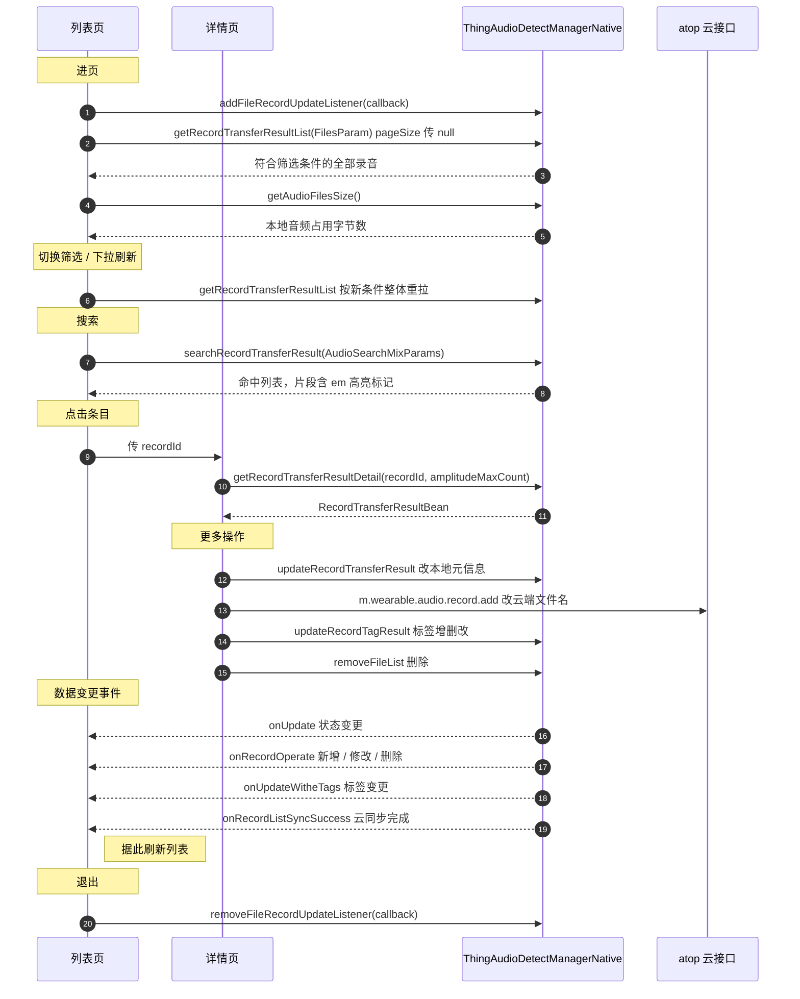

# 模块 3 · 文件管理

| 项 | 内容 |
|---|---|
| Demo 页面 | [`NativeRecordListActivity`](../../ai_voice/src/main/java/com/tuya/smart/ai_voice/nativeui/NativeRecordListActivity.java)（列表 / 筛选 / 搜索 / 空间 / 删除）<br>[`NativeRecordDetailActivity`](../../ai_voice/src/main/java/com/tuya/smart/ai_voice/nativeui/NativeRecordDetailActivity.java)（详情）<br>[`NativeRecordActionSheet`](../../ai_voice/src/main/java/com/tuya/smart/ai_voice/nativeui/NativeRecordActionSheet.java)（改名 / 标签 / 删除） |
| 云端写入 | [`AudioContentBusiness`](../../ai_voice/src/main/java/com/tuya/smart/ai_voice/nativeui/business/AudioContentBusiness.java) |
| 全局约定 | [接入指南](./README.md) |

---

## 一、能力概述

录音文件的查询、筛选、搜索、删除、元信息修改与空间统计。

本模块的 `IRecordFileUpdateCallback` 是**跨模块共用**的数据变更事件源——
模块 2 的转写完成、模块 5 的导入完成、模块 6 的云同步完成都通过它通知界面刷新。

---

## 二、接口清单

| 方法 | 作用 | 回调 |
|---|---|---|
| `getRecordTransferResultList` | 查询录音列表 | `IRecordCallBack<List<RecordTransferResultBean>>` |
| `getRecordTransferResultDetail` | 按 `recordId` 查单条详情 | `IRecordCallBack<RecordTransferResultBean>` |
| `searchRecordTransferResult` | 关键词搜索 | `IRecordCallBack<ArrayList<AudioSearchMixItem>>` |
| `updateRecordTransferResult` | 更新元信息（改名 / 已读 / 回收站等） | `IResultCallback` |
| `removeFileList` | 删除，三种语义 | `IResultCallback` |
| `getAudioFilesSize` | 本地音频占用空间 | `IRecordCallBack<Integer>` |
| `updateRecordTagResult` | 标签增删改 | `IResultCallback` |
| `operateAudioFileSafePath` | 获取 / 删除合规分享路径 | `IRecordCallBack<String>` |

事件监听：`IRecordFileUpdateCallback`。

---

## 三、整体时序



---

## 四、接口详解

### `getRecordTransferResultList(FilesParam param, IRecordCallBack<List<RecordTransferResultBean>> callback)`

查询录音列表。

| 参数 | 类型 | 必填 | 说明 |
|---|---|---|---|
| `param` | [`FilesParam`](#filesparam) | 是 | 筛选条件，各字段传 `null` 表示不限 |
| `callback` | `IRecordCallBack<List<RecordTransferResultBean>>` | 否 | 返回 [`RecordTransferResultBean`](#recordtransferresultbean) 列表 |

**`pageSize` 传 `null` 即查询全部**，这是推荐做法：录音记录量级有限，
一次取回可省掉游标维护与「加载更多」的状态管理。

接口也支持**游标式**分页（不是页码式）：`pageSize` 给定每页条数，
`lastFileId` 传上一页末条的 `recordTransferId`，首页传 `null`。
记录量大到影响首屏时再用。

---

### `getRecordTransferResultDetail(String recordId, int amplitudeMaxCount, IRecordCallBack<RecordTransferResultBean> callback)`

按业务 `recordId` 查单条详情。

| 参数 | 类型 | 必填 | 说明 |
|---|---|---|---|
| `recordId` | `String` | 是 | 业务录音 ID。**不是 `recordTransferId`** |
| `amplitudeMaxCount` | `int` | 是 | 振幅采样上限。`0` 表示返回全量；画波形时按控件宽度给个上限可减少数据量 |
| `callback` | `IRecordCallBack<RecordTransferResultBean>` | 否 | 返回详情 Bean |

---

### `searchRecordTransferResult(AudioSearchMixParams param, IRecordCallBack<ArrayList<AudioSearchMixItem>> callback)`

跨标题 / 标签 / 摘要 / 转写正文的关键词搜索。

| 参数 | 类型 | 必填 | 说明 |
|---|---|---|---|
| `param` | [`AudioSearchMixParams`](#audiosearchmixparams) | 是 | 检索条件 |
| `callback` | `IRecordCallBack<ArrayList<AudioSearchMixItem>>` | 否 | 返回 [`AudioSearchMixItem`](#audiosearchmixitem) 列表 |

---

### `updateRecordTransferResult(...)`

更新文件元信息。**所有可选参数传 `null` 表示「不修改该字段」**，只填要改的那个。

```java
void updateRecordTransferResult(long recordTransferId, String name, Integer status,
                                String visit, Boolean remove, Integer transfer,
                                Long directoryId, String storageKey,
                                IResultCallback callback)
```

| 参数 | 类型 | 必填 | 说明 |
|---|---|---|---|
| `recordTransferId` | `long` | 是 | 文件 ID |
| `name` | `String` | 否 | 文件名；`null` 不修改 |
| `status` | `Integer` | 否 | 同步状态：`0` 未上传 / `1` 上传中 / `2` 已上传 / `3` 失败；`null` 不修改 |
| `visit` | `String` | 否 | 访问状态。**类型是 String**，传数字字符串（`"1"`）；也兼容 `"true"`/`"false"`。`null` 不修改 |
| `remove` | `Boolean` | 否 | `true` 移入回收站（软删除）；`null` 不修改 |
| `transfer` | `Integer` | 否 | 转录状态：`0` 未 / `1` 中 / `2` 已 / `3` 失败；`null` 不修改 |
| `directoryId` | `Long` | 否 | 目录 ID；`null` 不修改 |
| `storageKey` | `String` | 否 | 云端存储 key；`null` 不修改 |
| `callback` | `IResultCallback` | 否 | 结果回调 |

> ⚠️ **本接口只改本地库，不写云端。** 需要跨端一致时见[重命名要写两处](#重命名要写两处)。

---

### `removeFileList(List<Long> fileIds, boolean isDeleteAll, IResultCallback callback)`

删除。同一接口靠两个入参组合出三种语义，见[第六节](#删除的三种语义)。

| 参数 | 类型 | 必填 | 说明 |
|---|---|---|---|
| `fileIds` | `List<Long>` | 否 | 要删除的文件 ID 列表。传 `null` 或空列表有特殊语义 |
| `isDeleteAll` | `boolean` | 是 | `true` 彻底删除（本地 + 云端）；`false` 只删本地音频 |
| `callback` | `IResultCallback` | 否 | 结果回调 |

---

### `getAudioFilesSize(IRecordCallBack<Integer> callback)`

查询本地音频占用空间。

| 参数 | 类型 | 必填 | 说明 |
|---|---|---|---|
| `callback` | `IRecordCallBack<Integer>` | 否 | 返回**字节数**，展示时需自行换算 |

---

### `updateRecordTagResult(UpdateRecordTagResultParams param, IResultCallback callback)`

标签增删改。

| 参数 | 类型 | 必填 | 说明 |
|---|---|---|---|
| `param` | [`UpdateRecordTagResultParams`](#updaterecordtagresultparams) | 是 | 三种 `bizType` 的 `tags` 含义不同，见[第六节](#标签的三种-biztype) |
| `callback` | `IResultCallback` | 否 | 结果回调 |

---

### `operateAudioFileSafePath(boolean isGetPath, String audioPath, IRecordCallBack<String> callback)`

获取或删除音频文件的合规可访问路径。

| 参数 | 类型 | 必填 | 说明 |
|---|---|---|---|
| `isGetPath` | `boolean` | 是 | `true` 获取路径 / `false` 删除已生成的路径 |
| `audioPath` | `String` | 是 | earphone 目录下的音频文件地址 |
| `callback` | `IRecordCallBack<String>` | 否 | 返回可访问路径 |

> 该接口是为小程序容器提供合规路径的桥接能力。Native 直接持有 `filePath` 即可播放，
> 通常无需调用，**本 Demo 未实现**。

---

### 事件监听

#### `IRecordFileUpdateCallback<List<RecordUpdateInfo>>`

```java
manager.addFileRecordUpdateListener(callback);
manager.removeFileRecordUpdateListener(callback);
```

| 回调 | 说明 |
|---|---|
| `onUpdate(List<RecordUpdateInfo> infos)` | 条目状态变更（转写完成、总结完成等），可做局部刷新 |
| `onRecordOperate(String operate, List<RecordUpdateInfo> infos)` | 文件新增 / 修改 / 删除。`operate` 取值见 `RecordOperateDef`；新增会改变列表长度，需全量刷新 |
| `onRecordListSyncSuccess()` | 云同步完成，本地数据可能大批变化，建议全量刷新 |
| `onUpdateWitheTags(List<RecordUpdateInfo> infos)` | 仅标签变更 |

四个回调**语义不同**，按需决定局部刷新还是全量重拉。

---

## 五、数据结构

### `FilesParam`

列表查询入参。**所有字段传 `null` 表示该维度不过滤**。

| 字段 | 类型 | 说明 |
|---|---|---|
| `directoryId` | `Long` | 限定目录；`null` 查所有目录 |
| `recordType` | `Integer` | 录音类型：`0` 电话 / `1` 会议 / `5` 音频导入 等；`null` 查全部 |
| `deviceId` | `String` | 限定设备；`null` 查所有设备 |
| `transfer` | `Integer` | 转写状态：`0` 未 / `1` 中 / `2` 成功 / `3` 失败；`null` 查全部 |
| `source` | `Integer` | 来源：`0` app / `1` 设备；`null` 查全部 |
| `remove` | `Boolean` | `true` 查回收站 / `false` 查正常记录；`null` 两者都查 |
| `orderBy` | `Integer` | 排序字段：`0` fileId / `1` 录音时间 / `2` 更新时间 |
| `asc` | `Integer` | `0` 降序 / `1` 升序 |
| `lastFileId` | `Integer` | **分页游标**，传上一页末条的 `recordTransferId`；不分页时传 `null` |
| `pageSize` | `Integer` | 每页条数；**`null` 或 `0` 表示不分页，返回全部**（推荐） |

构造顺序：`(directoryId, recordType, deviceId, transfer, source, remove, orderBy, asc, lastFileId, pageSize)`。

### `RecordTransferResultBean`

列表与详情的返回对象。字段较多，按用途分组：

**标识与基本信息**

| 字段 | 类型 | 说明 |
|---|---|---|
| `recordTransferId` | `Long` | 文件 ID。删除、转写结果查询、分页游标都用它 |
| `recordId` | `String` | 业务录音 ID。详情、标签、合并、分享用它 |
| `name` | `String` | 文件名 |
| `recordTime` | `Long` | 录音时间（**秒**级时间戳，注意不是毫秒） |
| `duration` | `Long` | 录音时长（毫秒） |
| `recordType` | `Integer` | `0` 电话 / `1` 现场+实时 / `2`、`3` 面对面 / `4` 文本翻译 / `5` 音频导入 |
| `deviceId` | `String` | 设备 ID |
| `deviceUniqueId` | `String` | 设备侧生成的录音唯一标识 |
| `directoryId` | `Long` | 目录 ID |

**文件与音频**

| 字段 | 类型 | 说明 |
|---|---|---|
| `filePath` | `String` | 录音文件路径 |
| `wavFilePath` | `String` | ⚠️ 已废弃，统一用 `filePath` |
| `amplitudes` | `String` | 振幅串（逗号分隔），画波形用 |
| `audioFormat` | `Integer` | 音频格式 |
| `source` | `Integer` | 音频源，取值与 `audioSource` 一致 |
| `storageKey` | `String` | 云端存储 key |

**处理状态**

| 字段 | 类型 | 说明 |
|---|---|---|
| `transfer` | `Integer` | 转写：`0` 未 / `1` 中 / `2` 已 / `3` 失败 |
| `summary` | `Integer` | 总结：`1` 未 / `2` 中 / `3` 成功 / `4` 失败（`0` 兼容老数据） |
| `transferType` | `Integer` | 转写模式：`0` 文件转写 / `1` 实时转写。**取正文时的分支判据之一** |
| `cloudTranscription` | `boolean` | 是否云端转写。**分支判据之二** |
| `isFromCloud` | `boolean` | 是否云同步下来的记录。**分支判据之三** |
| `transcriptionStatus` | `Integer` | ASR 覆盖度：`0` 未知 / `1` 无 / `2` 部分 / `3` 完整 |
| `translateState` | `Integer` | 翻译状态 |
| `summaryImageStatus` | `Integer` | 总结配图：`1` 未 / `2` 中 / `3` 成功 / `4` 失败 |
| `noteFileConvertState` | `Integer` | note 转化：`0` 成功 / `1` 中 / `2` 失败 |

**同步与展示**

| 字段 | 类型 | 说明 |
|---|---|---|
| `status` | `Integer` | 同步状态：`0` 未上传 / `1` 上传中 / `2` 已上传 / `3` 失败 |
| `cloudSyncStatus` | `Integer` | 单条云同步 UI 状态：`0` 不展示 / `5` 上传中 / `10` 上传成功 / `-10` 上传失败 / `15` 下载中 / `20` 下载成功 / `-20` 下载失败 |
| `visit` | `Integer` | 访问状态，四个取值见[已读 / 未读](#已读--未读) |
| `remove` | `boolean` | 是否在回收站 |
| `linkShared` | `Integer` | 分享：`0` 未分享 / `1` 已分享 |
| `tags` | `List<String>` | 标签列表 |
| `offlineUploadProgress` | `Integer` | 离线上传进度 `0`~`100` |
| `offlineUploadStatus` | `Integer` | 离线上传：`-1` 未开始 / `0` 等待 / `1` 中 / `2` 完成 / `3` 失败 / `4` 取消 |

**语言与其他**

| 字段 | 类型 | 说明 |
|---|---|---|
| `needTranslate` | `boolean` | 是否开启了翻译 |
| `originalLanguage` | `String` | 源语言 |
| `targetLanguage` | `String` | 目标语言 |
| `agentId` | `String` | 智能体 ID |

### `AudioSearchMixParams`

搜索入参。

| 字段 | 类型 | 必填 | 说明 |
|---|---|---|---|
| `keyword` | `String` | 否 | **保留字段**，传 `null` |
| `content` | `String` | 是 | 检索词。实际检索只看这个字段 |
| `pageNum` | `Integer` | 否 | 页码，默认 `1` |
| `pageSize` | `Integer` | 否 | 页大小，默认 `20` |

### `AudioSearchMixItem`

搜索结果单条。

| 字段 | 类型 | 说明 |
|---|---|---|
| `recordId` | `String` | 业务录音 ID，用它进详情 |
| `title` | `String` | 标题，命中部分被 `<em>` 包裹 |
| `tags` | `List<String>` | 标签列表，命中者带高亮且置顶 |
| `summary` | `String` | 总结摘要片段，可含 `<em>` |
| `content` | `String` | 转写正文片段，可含 `<em>` |
| `score` | `Integer` | 综合得分 |
| `bizTime` | `Long` | 业务时间戳（毫秒） |
| `audioSource` | `int` | 音频来源，默认 `-1` |
| `isFromCloud` | `boolean` | 是否云同步记录 |
| `recordTime` | `long` | 录音时间（秒） |
| `duration` | `long` | 录音时长（毫秒） |

> `<em>` 是接口约定的高亮标记，需转成富文本渲染才能看到效果。

### `UpdateRecordTagResultParams`

标签更新入参。

| 字段 | 类型 | 必填 | 说明 |
|---|---|---|---|
| `recordId` | `String` | 是 | 业务录音 ID |
| `bizType` | `int` | 是 | `0` 新增 / `1` 删除 / `2` 重排顺序 |
| `tags` | `List<String>` | 否 | 内容随 `bizType` 变化，见[第六节](#标签的三种-biztype) |

### `RecordUpdateInfo`

数据变更事件的元素，`IRecordFileUpdateCallback` 各回调的列表项。

| 字段 | 类型 | 说明 |
|---|---|---|
| `recordId` | `String` | 业务录音 ID。**按它过滤出自己关心的条目** |
| `name` | `String` | 文件名 |
| `cloudSyncStatus` | `int` | 云同步状态 |
| `transferStatus` | `int` | 转写状态 |
| `summaryStatus` | `int` | 总结状态 |
| `translateStatus` | `int` | 翻译状态 |
| `noteFileConvertState` | `int` | note 转化状态 |
| `asrStatus` | `int` | ASR 状态 |
| `summaryImageStatus` | `int` | 总结配图状态 |
| `summaryImageUrl` | `String` | 总结配图 URL |
| `tags` | `List<String>` | 标签列表 |

---

## 六、关键约定

### 两个 ID，别用混

| ID | 类型 | 用在哪 |
|---|---|---|
| `recordTransferId` | `Long` | `updateRecordTransferResult`、`removeFileList`、转写 / 总结结果查询 |
| `recordId` | `String` | `getRecordTransferResultDetail`、`updateRecordTagResult`、`mergeRecordList`、分享链接 |

列表返回的 bean 两个都有；详情页建议用 `recordId` 进入，再从详情 bean 里取 `recordTransferId`。

### 删除的三种语义

同一个 `removeFileList` 接口，靠两个入参组合出三种行为：

| `fileIds` | `isDeleteAll` | 行为 |
|---|---|---|
| 非空 | `true` | 彻底删除，本地 + 云端，**不可恢复** |
| 非空 | `false` | 只删本地音频文件，录音记录保留，可重新下载 |
| 空 / `null` | `false` | 清空全部本地音频缓存，所有记录保留 |

另有一种「软删除」不走这个接口：`updateRecordTransferResult(id, remove=true)`
把记录移入回收站，之后可用 `FilesParam.remove=true` 查回并还原。
**本 Demo 不演示回收站**，列表固定按「未删除」查询。

### 重命名要写两处

文件名在**本地库**和**云端**各存一份，SDK 只管本地，云端要自己调 atop：

| 写入 | 接口 | 效果 |
|---|---|---|
| 本地 | `updateRecordTransferResult(recordTransferId, name, ...)` | 界面立刻显示新名字，云端仍是旧值 |
| 云端 | atop `m.wearable.audio.record.add` | 其他端与重装后能看到，本地库不会自动跟着变 |

只写其中一处就会两端不一致。云端接口的入参形态要注意：业务字段先拼成 JSON 字符串，
再整体放进 `audioRecordRequest` 一个字段，而不是平铺成多个 post 参数。

```
audioRecordRequest = {"recordId":"xxx","name":"新名字","ownerId":<当前家庭ID>}
```

Demo 里有**两条**改名路径，都走这套双写：

| 触发 | 位置 |
|---|---|
| 用户手动改名 | 详情页「更多操作」→ 重命名 |
| 总结完成后用 AI 提炼的标题自动改名 | 详情页 `applySummaryTitle()` |

云端写入统一封装在 `AudioContentBusiness`，接口名与入参形态只在这一个类里定义。
两条路径都是本地成功后再写云端，云端失败时记录日志但**不回滚本地**，
让「本地已改、云端未同步」这个中间态可见。

> 小程序在自动改名这条路径上带的 `updateCloud: false`，指的是**不重写云端的总结内容**，
> 与文件名是否同步到云端无关，别据此以为文件名不用写云端。

### 已读 / 未读

`visit` 有四个取值，**转写前后各有一组未读 / 已读**：

| 值 | 含义 |
|---|---|
| `0` | 未读 |
| `1` | 已读 |
| `2` | 已转录未读 |
| `3` | 已转录已读 |

分成两组的原因：转写完成本身要提醒用户「有新内容可看」，
所以转写完成会把已读的条目重新置为 `2`，列表红点再次亮起。

进入详情即视为已读，做一次**单向跃迁**（`0 → 1`、`2 → 3`），已是已读态则不动作。
与改名一样要写两处：

| 写入 | 接口 | 说明 |
|---|---|---|
| 本地 | `updateRecordTransferResult(id, visit=...)` | 红点立刻消失。注意 `visit` 参数是 `String`，传数字字符串即可 |
| 云端 | atop `m.wearable.audio.record.read.update` | 字段**平铺**传 `recordId` + `visit`，不套 `audioRecordRequest` 那层 JSON |

> 云端这一路是 **fire-and-forget**：失败既不回滚本地也不提示用户——
> 已读状态丢一次的代价，远小于为此打断用户阅读。

### 标签的三种 bizType

`updateRecordTagResult` 靠 `bizType` 区分操作，**三种的 `tags` 含义不同**：

| `bizType` | 操作 | `tags` 传什么 |
|---|---|---|
| `0` | 新增 | 要新增的标签 |
| `1` | 删除 | 要删除的标签 |
| `2` | 重排顺序 | **完整的新顺序**，不是被移动的那几个 |

`bizType=2` 漏传标签会导致缺失的那些被丢弃，这是最容易出错的一处。

---

## 七、错误码

**本模块没有专属错误码表。** 各接口失败时走通用回调
`onError(String code, String error)`，`code` 为底层透传，无固定枚举。

实践建议：

- 列表 / 详情查询失败 → 展示重试入口，不必解析 `code`
- 删除、改名、标签这类写操作失败 → 提示失败并保持界面为操作前的状态，
  不要乐观更新后不回滚
- 需要区分具体原因时，打印 `code` 与 `error` 排查，不要据此做分支逻辑

---

## 八、接入清单

1. `addFileRecordUpdateListener` / `removeFileRecordUpdateListener` 成对注册与注销，
   **传同一实例**
2. 列表查询把 `pageSize` 传 `null` 即取全部；确需分页时游标是上一页末条的
   `recordTransferId`，不是页码
3. 搜索填 `content`，`keyword` 留空；结果里的 `<em>` 要转成富文本才有高亮
4. 分清 `recordTransferId`（Long）与 `recordId`（String）的适用接口
5. `removeFileList` 的三种语义按入参组合区分，彻底删除前应二次确认
6. `updateRecordTransferResult` 的可选参数传 `null` 表示「不修改该字段」，
   只填要改的那个
7. `updateRecordTagResult` 的 `bizType=2` 必须传完整新顺序
8. 四个数据变更回调各有语义：`onUpdate` 状态变更、`onRecordOperate` 增删改、
   `onUpdateWitheTags` 标签变更、`onRecordListSyncSuccess` 云同步完成，
   按需决定局部刷新还是全量重拉
9. 改名与已读都要写云端，否则跨端不一致
