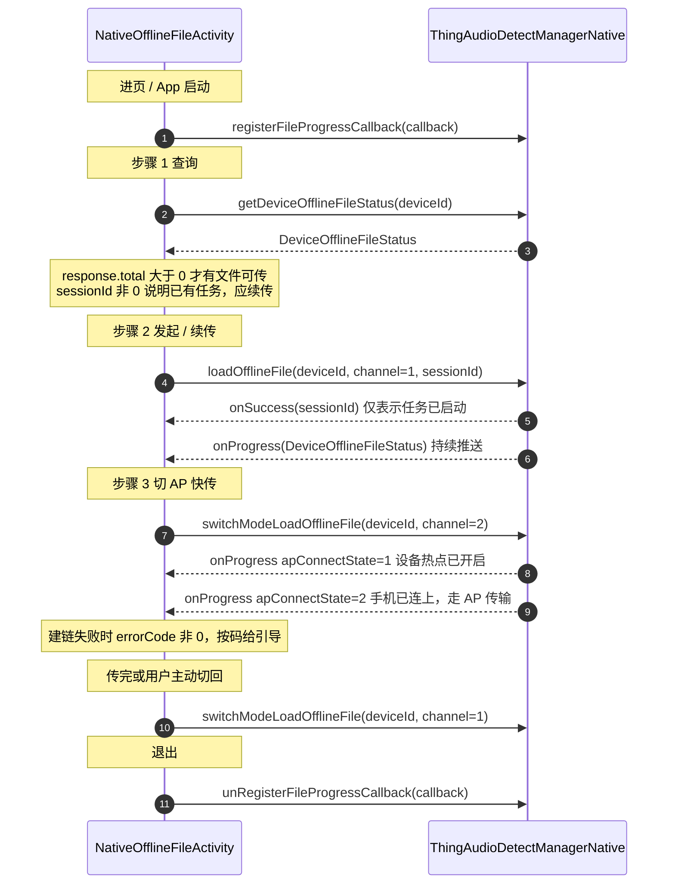

# 模块 4 · 离线文件传输

| 项 | 内容 |
|---|---|
| Demo 页面 | [`NativeOfflineFileActivity`](../../ai_voice/src/main/java/com/tuya/smart/ai_voice/nativeui/NativeOfflineFileActivity.java) |
| 全局约定 | [接入指南](./README.md) |

---

## 一、能力概述

把设备（录音卡片 / 耳机）本地缓存的录音文件下载到手机。

设备离线时录下的音频先存在设备上，回到手机附近才回传。传输有两条通道：**BLE** 稳但慢，
**AP（设备开热点、手机连上去）** 快但要建链，且建链期间手机会断开原有 Wi-Fi。
典型策略是先用 BLE 起传，文件多时提示用户切 AP。

> 传完的文件会进入模块 3 的录音列表，是否自动转写由模块 6 的云同步开关与业务策略决定。

---

## 二、接口清单

| 方法 | 作用 | 回调 |
|---|---|---|
| `getDeviceOfflineFileStatus` | 查询设备待传文件与会话状态 | `IRecordCallBack<DeviceOfflineFileStatus>` |
| `loadOfflineFile` | 发起 / 续传下载任务 | `IOfflineFilesProgress` |
| `switchModeLoadOfflineFile` | 在 AP / BLE 间切换通道 | `IOfflineFilesProgress` |
| `registerFileProgressCallback` | 注册全局进度回调 | — |
| `unRegisterFileProgressCallback` | 注销全局进度回调 | — |

---

## 三、整体时序



---

## 四、接口详解

### `getDeviceOfflineFileStatus(String deviceId, IRecordCallBack<DeviceOfflineFileStatus> callback)`

查询设备离线文件列表与下载会话状态。

| 参数 | 类型 | 必填 | 说明 |
|---|---|---|---|
| `deviceId` | `String` | 是 | 设备 ID。**手机本身没有离线文件概念**，不要传 `"PHONE"` |
| `callback` | `IRecordCallBack<DeviceOfflineFileStatus>` | 否 | 返回 [`DeviceOfflineFileStatus`](#deviceofflinefilestatus)，可能为 `null` |

两个判据决定下一步：

- `response.total > 0` —— 设备上有待传文件，可以发起下载
- `sessionId != 0` —— 已有会话，`loadOfflineFile` 传这个值即为续传

---

### `loadOfflineFile(String deviceId, int channel, long sessionId, IOfflineFilesProgress callback)`

发起或续传离线文件下载任务。

| 参数 | 类型 | 必填 | 说明 |
|---|---|---|---|
| `deviceId` | `String` | 是 | 设备 ID |
| `channel` | `int` | 是 | `0` 未指定 / `1` BLE / `2` AP。起传建议用 `1` |
| `sessionId` | `long` | 是 | `0` 开启新任务；非 `0` 续传该会话 |
| `callback` | `IOfflineFilesProgress` | 否 | `onSuccess(sessionId)` 返回本次会话 ID |

> 传入的这个 `callback` 与全局回调的 `onProgress` **数据完全一致，会重复回调**。
> 生产环境择一即可：推荐进度只看全局回调，传入的这个只用来接 `onSuccess` / `onError`。

---

### `switchModeLoadOfflineFile(String deviceId, int channel, IOfflineFilesProgress callback)`

切换传输通道并继续传输。

| 参数 | 类型 | 必填 | 说明 |
|---|---|---|---|
| `deviceId` | `String` | 是 | 设备 ID |
| `channel` | `int` | 是 | `1` 切回 BLE / `2` 切到 AP |
| `callback` | `IOfflineFilesProgress` | 否 | 同上，只用于接调用结果 |

**接口本身不返回建链状态。** 切到 AP 之后的整个建链过程只能从进度回调里的
`response.apConnectState` 与 `errorCode` 读取，见[第六节](#六关键约定)。

---

### 事件监听 · `IOfflineFilesProgress`

```java
manager.registerFileProgressCallback(callback);     // 建议 App 级注册一次
manager.unRegisterFileProgressCallback(callback);   // 传同一实例
```

| 回调 | 说明 |
|---|---|
| `onProgress(DeviceOfflineFileStatus status)` | 进度与建链状态推送，**高频**，需自行节流后再刷 UI |
| `onSuccess(long sessionId)` | 任务已启动，返回会话 ID |
| `onError(String code, String error)` | 调用失败 |

传输不随页面生命周期结束，**建议在 App 级注册一次**，页面进出不影响，避免切页丢进度。

---

## 五、数据结构

### `DeviceOfflineFileStatus`

`getDeviceOfflineFileStatus` 的返回值，也是 `onProgress` 的回调参数。

| 字段 | 类型 | 说明 |
|---|---|---|
| `status` | `Integer` | 下载状态：`0` 未开始 / `1` 下载中 / `2` 已结束 |
| `sessionId` | `Long` | 任务 ID，`0` 表示尚未开始 |
| `response` | [`OfflineFilesResponse`](#offlinefilesresponse) | 传输详情 |
| `errorCode` | `Integer` | 过程中错误码，`0` 表示无错误 |

### `OfflineFilesResponse`

| 字段 | 类型 | 说明 |
|---|---|---|
| `channel` | `Integer` | 当前通道：`0` 未指定 / `1` BLE / `2` AP |
| `apConnectState` | `Integer` | AP 建链状态：`0` 热点未开启 / `1` 已开启 / `2` 已连接 |
| `speed` | `Double` | 下载速度（KB/s） |
| `total` | `Integer` | 可下载文件总数 |
| `size` | `Integer` | 已下载文件数 |
| `curFile` | [`FileDigest`](#filedigest) | 当前正在下载的文件 |
| `files_waiting` | `List<FileDigest>` | 待下载 |
| `files_failed` | `List<FileDigest>` | 下载失败 |
| `files_transform` | `List<FileDigest>` | 已传输、转换中 |
| `files_successed` | `List<FileDigest>` | 传输并转换完成 |
| `remainingDownloadTime` | `Integer` | 预计剩余时间（秒） |
| `downloadedFileProgress` | `Integer` | 整体进度（0-100） |

> 文件传完后还有一步**转换**：先进 `files_transform`，转换完才进 `files_successed`。
> 判断「全部完成」应看 `files_successed.size() == total`，只看下载进度会早于实际可用。

### `FileDigest`

| 字段 | 类型 | 说明 |
|---|---|---|
| `fileId` | `Long` | 文件 ID |
| `fileType` | `Integer` | 文件类型 |
| `progress` | `Double` | 单文件进度（0-100） |
| `timeStamp` | `Long` | 时间戳 |
| `fileName` | `String` | 文件名 |
| `fileDuring` | `Long` | 音频时长 |

---

## 六、关键约定

### AP 建链看 `apConnectState`，不看接口返回

调 `switchModeLoadOfflineFile(channel=2)` 后，`onSuccess` 只表示切换指令已下发。
真正的建链进展全在进度回调里：

| `apConnectState` | 含义 | 界面该做什么 |
|---|---|---|
| `0` | 设备热点尚未开启 | 显示「正在建立连接」 |
| `1` | 设备热点已开启，手机尚未连上 | 仍在建链中，可提示用户勿离开 |
| `2` | 手机已连上设备热点 | 建链完成，按 AP 速度展示进度 |

同时要盯 `errorCode`：非 `0` 表示建链失败，此时 `apConnectState` 可能仍停在 `0`。

### 退出前切回 BLE

停留在 AP 模式时设备热点会一直占用，手机也维持在设备热点上而非正常 Wi-Fi。
建链中或 AP 传输中退出，建议先弹确认框，确认后调
`switchModeLoadOfflineFile(deviceId, 1)` 切回 BLE。

**Demo 未实现这个拦截**，属于产品交互，各家 App 自行决定。同样未实现的还有
建链失败重试计数（AI 笔记小程序的策略是最多重试 3 次切 AP，超限弹错误框）。

### 自动化触发

Demo 为便于逐步观察做成了三步手动。AI 笔记小程序里这一步是**全自动**的：
录音结束或首页可见时遍历在线的卡片设备，逐个 `getDeviceOfflineFileStatus`，
发现 `response.total > 0` 就直接以 `channel=1`、`sessionId=`（已有值或 `0`）发起下载，
全程无用户操作，只在有文件可传时才在界面上露出进度条。

---

## 七、错误码

错误码从 `onProgress` 推送的 `DeviceOfflineFileStatus.errorCode` 读取，
不走 `onError`。分两类给不同引导：

| 码 | 含义 | 引导 |
|---|---|---|
| `10091` | Wi-Fi 打开失败 | 引导用户手动打开手机 Wi-Fi 后重试 |
| `10092`、`10096`、`10300`~`10305` | 连接设备热点失败 | 提示靠近设备后重试，或切回 BLE 继续传 |
| 其余非 `0` 值 | 传输过程异常 | 通用失败提示，可重新发起 |

`loadOfflineFile` / `switchModeLoadOfflineFile` 的 `onError(code, error)` 是**调用层失败**
（设备离线、参数非法等），与上表的传输错误码不是一套，不要混在一起映射。

---

## 八、接入清单

1. `registerFileProgressCallback` / `unRegisterFileProgressCallback` 成对调用，**传同一实例**；
   建议 App 级注册一次，而不是随页面进出
2. 起传前先 `getDeviceOfflineFileStatus`，`total > 0` 才发起；
   `sessionId` 非 `0` 时传该值续传，传 `0` 会丢掉已传进度
3. `loadOfflineFile` 传入的回调与全局回调进度重复，生产环境择一
4. AP 建链状态只能从 `apConnectState` + `errorCode` 读，接口返回值里没有
5. 「全部完成」看 `files_successed`，下载完还有一步转换
6. `onProgress` 高频，刷 UI 前自行节流
7. 退出前若仍在 AP 模式，切回 BLE，否则设备热点持续占用
8. 传输错误码与调用失败的 `onError` 是两套，分开处理
