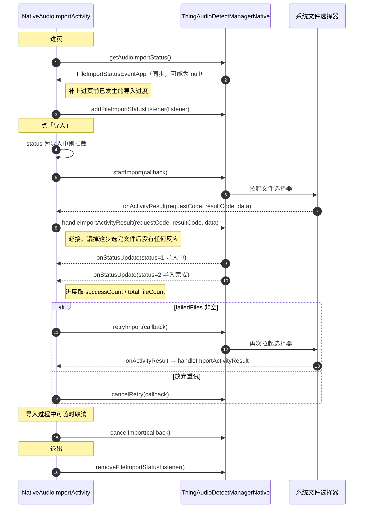

# 模块 5 · 音频导入

| 项 | 内容 |
|---|---|
| Demo 页面 | [`NativeAudioImportActivity`](../../ai_voice/src/main/java/com/tuya/smart/ai_voice/nativeui/NativeAudioImportActivity.java) |
| 全局约定 | [接入指南](./README.md) |

---

## 一、能力概述

把手机本地已有的音频文件导入为录音记录。导入后它就是一条普通录音，
可以照常转写、总结、重命名、加标签。

导入本身由 SDK 全程接管：拉起系统文件选择器、解码、转码、落库。
接入方要做的只有三件事——**回灌选择器结果**、渲染进度、处理失败重试。

---

## 二、接口清单

| 方法 | 作用 | 回调 |
|---|---|---|
| `startImport` | 开始导入，会拉起系统文件选择器 | `IAudioImportCallBack` |
| `retryImport` | 重试失败的文件，同样拉起选择器 | `IAudioImportCallBack` |
| `cancelImport` | 取消进行中的导入 | `IAudioImportCallBack` |
| `cancelRetry` | 放弃重试，清掉失败列表 | `IAudioImportCallBack` |
| `getAudioImportStatus` | 查询导入状态快照 | **同步返回** `FileImportStatusEventApp` |
| `handleImportActivityResult` | 回灌文件选择器结果，**必接** | 同步返回 |

事件监听：`IFileImportStatusListener`。

---

## 三、整体时序



---

## 四、接口详解

### `startImport(IAudioImportCallBack callback)`

开始导入。调用后 SDK 拉起系统文件选择器，用户选完文件的结果**不会自动回到 SDK**，
必须由宿主 Activity 回灌，见 [`handleImportActivityResult`](#handleimportactivityresultint-requestcode-int-resultcode-intent-data)。

| 参数 | 类型 | 必填 | 说明 |
|---|---|---|---|
| `callback` | `IAudioImportCallBack` | 否 | `onSuccess` 表示导入流程已发起，不代表文件已导入 |

发起前应先判当前状态是否为「导入中」，避免重复发起（重复发起会返回 `20115`）。

---

### `retryImport(IAudioImportCallBack callback)` / `cancelRetry(IAudioImportCallBack callback)`

`status == 2` 且 `failedFiles` 非空时的两条出路：重试或放弃。
`retryImport` 同样会拉起文件选择器，同样需要回灌结果。

| 参数 | 类型 | 必填 | 说明 |
|---|---|---|---|
| `callback` | `IAudioImportCallBack` | 否 | 结果回调 |

`cancelRetry` 清掉失败列表，之后可重新发起一次全新的导入。

---

### `cancelImport(IAudioImportCallBack callback)`

取消进行中的导入。已成功导入的文件**保留**，只中止尚未处理的部分。

| 参数 | 类型 | 必填 | 说明 |
|---|---|---|---|
| `callback` | `IAudioImportCallBack` | 否 | 结果回调 |

---

### `getAudioImportStatus()`

**同步返回** [`FileImportStatusEventApp`](#fileimportstatuseventapp)，无进行中任务时返回 `null`。

导入是跨页面的后台任务，用户完全可能在导入中途切走再切回。
进页调一次取快照，把界面恢复到当前进度，之后靠监听增量更新——**不要轮询**。

---

### `handleImportActivityResult(int requestCode, int resultCode, Intent data)`

把系统文件选择器的结果回灌给 SDK。**Native 接入必接**，小程序侧由容器 bridge 代为转交。

| 参数 | 类型 | 必填 | 说明 |
|---|---|---|---|
| `requestCode` | `int` | 是 | 原样透传，**无需自行判断**，SDK 内部识别是否属于自己的请求 |
| `resultCode` | `int` | 是 | 原样透传 |
| `data` | `Intent` | 是 | 原样透传，用户取消选择时可能为 `null` |

```java
@Override
protected void onActivityResult(int requestCode, int resultCode, @Nullable Intent data) {
    super.onActivityResult(requestCode, resultCode, data);
    ThingAudioDetectManagerNative.getInstance()
            .handleImportActivityResult(requestCode, resultCode, data);
}
```

> 漏掉这一步的表现是「用户选完文件后毫无反应」——既没有报错，也不会有任何状态事件。
> 这是本模块最容易踩的坑。

---

### 事件监听 · `IFileImportStatusListener`

```java
manager.addFileImportStatusListener(listener);
manager.removeFileImportStatusListener();   // 注意：无参
```

| 回调 | 说明 |
|---|---|
| `onStatusUpdate(FileImportStatusEventApp event)` | 导入状态与进度推送 |

> `removeFileImportStatusListener()` **无参**，会移除**全部**已注册的导入监听。
> 多个页面同时注册时，任一页面退出都会把其他页面的监听一并摘掉。

---

## 五、数据结构

### `FileImportStatusEventApp`

`getAudioImportStatus` 的返回值，也是 `onStatusUpdate` 的回调参数。

| 字段 | 类型 | 说明 |
|---|---|---|
| `status` | `Int` | 导入状态，取值见下表 |
| `errorCode` | `Int?` | 任务级错误码，`status` 为 `3` / `4` 时有效 |
| `errorMessage` | `String?` | 错误消息 |
| `totalFileCount` | `Int?` | 本次导入的文件总数 |
| `successCount` | `Int?` | 已成功导入数，进度即 `successCount / totalFileCount` |
| `failedFiles` | `List<FailedFileInfo>?` | 失败文件列表 |
| `timestamp` | `Long` | 事件时间戳 |

**`status` 取值**

| 值 | 含义 | 界面处理 |
|---|---|---|
| `0` | 未开始 | 可发起导入 |
| `1` | 导入中 | 展示进度，拦截重复发起，提供「取消导入」 |
| `2` | 导入完成 | **还要看 `failedFiles`**，非空时提供「重试 / 放弃」 |
| `3` | 导入中断 | 看 `errorCode` |
| `4` | 分享导入异常 | 由系统分享入口触发的导入失败，看 `errorCode` |

> `status == 2` 不等于全部成功。部分文件失败时状态同样是 `2`，
> 只有 `failedFiles` 为空才是真正的全部成功。

### `FailedFileInfo`

| 字段 | 类型 | 说明 |
|---|---|---|
| `fileName` | `String?` | 失败的文件名，用于展示给用户 |
| `errorCode` | `Int?` | 该文件的失败原因，取值见[第七节](#七错误码) |

---

## 六、关键约定

### 按原因归类展示失败

失败码有 11 个，但可归纳的原因只有 6 类。逐条罗列裸码对用户没有意义，
建议按原因分组、每组下挂文件名：

```
3 个文件导入失败

格式不支持或文件损坏
  · 会议录音.amr
  · 备忘.wma

文件时长过长
  · 长播客.mp3
```

### 导入成功的文件会进录音列表

导入完成后这些文件就是普通录音记录，文件列表页可通过
`IRecordFileUpdateCallback.onRecordOperate`（新增）感知并刷新，
无需在导入页额外通知列表页。

---

## 七、错误码

分两个层级，来自事件对象的不同字段。

### 任务级 —— `FileImportStatusEventApp.errorCode`

整个导入任务失败的原因，`status` 为 `3` / `4` 时有效。

| 码 | 含义 |
|---|---|
| `20101` | 文件数量超出上限 |
| `20102` | 单个文件过大 |
| `20104` | 手机存储空间不足 |
| `20115` | 导入已经开始，无法重复导入 |
| `20116` | 录音进行中，无法导入 |
| `20117` | 存在可恢复的导入任务，无法重复导入 |
| `20118` | 存在导入失败的记录（兜底码） |

### 文件级 —— `FailedFileInfo.errorCode`

`failedFiles` 里每个失败文件各自的原因。

| 码 | 含义 | 建议归类 |
|---|---|---|
| `20103` | 格式异常 | 格式不支持或文件损坏 |
| `20110` | 文件格式错误，无法解码 | 同上 |
| `20105` | 文件不存在 | 文件不存在 |
| `20106` | 文件属性已改变 | 文件已被修改或移动 |
| `20107` | 文件时长过长 | 文件时长过长 |
| `20111` | 因文件错误导致解码中断 | 导入中断 |
| `20112` | 导入异常中断 | 同上 |
| `20108` | SDK 初始化失败 | 系统繁忙 |
| `20109` | 启动音频解码失败 | 同上 |
| `20113` | mp3 创建失败 | 同上 |

---

## 八、接入清单

1. **宿主 Activity 必须重写 `onActivityResult` 并调 `handleImportActivityResult`**，
   `requestCode` 无需自行判断。漏掉这步导入会静默失败
2. 进页调一次 `getAudioImportStatus()` 取快照（同步返回，**可能为 `null`**），
   之后靠 `IFileImportStatusListener` 增量更新，不要轮询
3. 发起前判「是否正在导入」，避免重复发起触发 `20115`
4. `status == 2` 时还要检查 `failedFiles`，非空才说明有文件失败
5. 失败原因按类归并展示，不要把裸码抛给用户
6. `removeFileImportStatusListener()` **无参**，会移除全部导入监听，多页面注册时注意
7. `cancelImport` 只中止未处理的部分，已导入的文件保留
