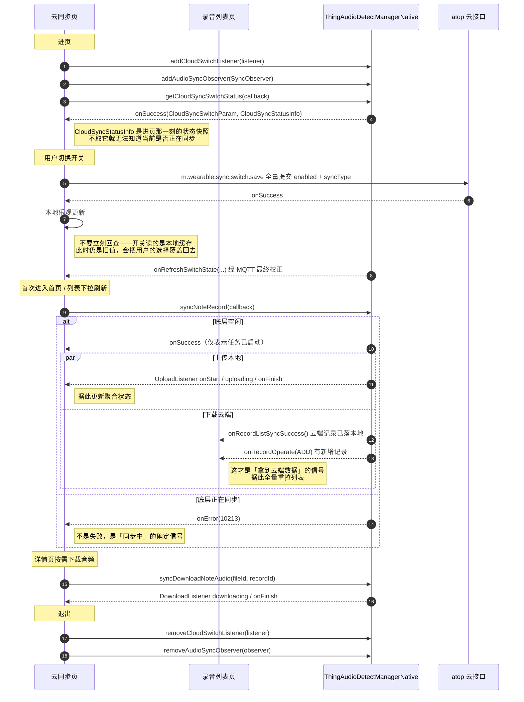

# 模块 6 · 云同步

| 项 | 内容 |
|---|---|
| Demo 页面 | [`NativeCloudSyncActivity`](../../ai_voice/src/main/java/com/tuya/smart/ai_voice/nativeui/NativeCloudSyncActivity.java) |
| 开关写入 | [`CloudSyncSwitchBusiness`](../../ai_voice/src/main/java/com/tuya/smart/ai_voice/nativeui/business/CloudSyncSwitchBusiness.java) |
| 全局约定 | [接入指南](./README.md) |

---

## 一、能力概述

把本地录音（记录 + 音频）同步到云端，并把云端的记录拉回本地，
实现换机、多端可见与本地清理后仍可恢复。

**这个模块有一半不是 SDK 能力**：开关的读取与同步的执行在 SDK 内，
但**开关的写入不在**，需要接入方自行调 atop 接口。这是本模块最需要先建立的认知。

---

## 二、接口清单

| 方法 | 作用 | 回调 |
|---|---|---|
| `getCloudSyncSwitchStatus` | 读开关 + 取同步状态快照 | `ICloudSyncSwitchCallBack<CloudSyncSwitchParam, CloudSyncStatusInfo>` |
| `syncNoteRecord` | 立即发起一次同步 | `IResultCallback` |
| `syncDownloadNoteAudio` | 按需下载单条录音的音频 | **同步无返回** |
| atop `m.wearable.sync.switch.save` | **写**开关，非 SDK 能力 | 自行封装 |

事件监听：`ICloudSwitchListener`（开关变化）、`SyncObserver`（上传 / 下载过程）。

---

## 三、整体时序



---

## 四、接口详解

### `getCloudSyncSwitchStatus(ICloudSyncSwitchCallBack<CloudSyncSwitchParam, CloudSyncStatusInfo> callback)`

读取云同步开关，**并一并返回当前的聚合同步状态快照**。异步回调。

| 参数 | 类型 | 必填 | 说明 |
|---|---|---|---|
| `callback` | `ICloudSyncSwitchCallBack<CloudSyncSwitchParam, CloudSyncStatusInfo>` | 是 | `onSuccess(param, info)` 两个参数分别是[开关](#cloudsyncswitchparam)与[状态快照](#cloudsyncstatusinfo) |

> **进页必调。** 状态的另一个来源 `SyncObserver` 只在同步实际发生时才回调，
> 不取快照就无法知道「进页那一刻是否正在同步」，界面会一直显示错误状态直到下一次事件到达。
> 这与模块 5 的 `getAudioImportStatus`、模块 8 的 `getFileMergeStatus` 是同一套「快照 + 监听」模式。

> **开关状态读的是本地缓存**，该缓存由 MQTT 推送或后台校验更新。
> 因此**修改开关后不要立刻回查**——此时拿到的仍是旧值，会把用户刚做的选择覆盖回去。

---

### `syncNoteRecord(IResultCallback callback)`

发起一次同步。它是**双向**的：上传本地 Note（记录 + 音频），同时下载云端 Note。

| 参数 | 类型 | 必填 | 说明 |
|---|---|---|---|
| `callback` | `IResultCallback` | 否 | `onSuccess` 仅表示任务已启动；`onError(10213)` 见下 |

#### 什么时候调

不需要给用户一个「立即同步」按钮。AI 笔记的做法是**两个时机各调一次**：

| 时机 | 前置条件 | 说明 |
|---|---|---|
| 首页首次加载 | 无 | 进页无条件调一次，早于 `getCloudSyncSwitchStatus` |
| 录音列表下拉刷新 | 当前状态 ≠「同步中」**且** 上一次调用未在进行中 | 用户的下拉手势即「我要最新数据」 |

两道前置条件都要判：`CloudSyncStatusInfo.status == 1` 时说明底层已在同步，
再发一次只会拿到 `10213`；本地也要记一个 in-flight 标志，
避免连续下拉把请求叠起来。

失败**不必弹提示**——同步是后台行为，用户没有显式发起，报错反而是打扰。

> Demo 页面把它做成了一个手动按钮，只是为了便于逐步观察，不代表推荐的交互。

#### 怎么知道云端数据到手了

**不看 `onSuccess`，也不看 `DownloadListener`。** 三条线各管各的：

| 想知道什么 | 看哪里 |
|---|---|
| 本地录音有没有存上云 | `SyncObserver.UploadListener` → 聚合状态 |
| **云端记录有没有拉回本地** | **`IRecordFileUpdateCallback.onRecordListSyncSuccess()`** |
| 某条录音的音频文件下完没有 | `SyncObserver.DownloadListener.onFinish` |

云端的**记录**（标题、转写、总结这些元数据）落到本地库时，SDK 会推
`onRecordListSyncSuccess()`；如果这一批里有本地没有的新记录，还会额外推
`onRecordOperate`（新增）。**列表页收到这两个回调就该全量重拉**——
这才是「同步成功、有新数据可看」的信号。

`DownloadListener` 管的是**音频文件**的字节流，跟记录是否同步成功是两件事：
记录早就到了，音频可能还没下完，甚至根本不下（用户没点播放时按需下载才触发）。

> 这也是为什么 `syncNoteRecord` 的回调是 `IResultCallback` 而不是带数据的回调——
> 它的产出不是一个返回值，而是散落在三类事件里的状态变化。

---

### `syncDownloadNoteAudio(Long fileId, String recordId)`

按需下载指定录音的音频文件。**同步方法，无返回值也无回调**，
下载进度统一走 `SyncObserver.downloadListener`。

| 参数 | 类型 | 必填 | 说明 |
|---|---|---|---|
| `fileId` | `Long` | 是 | 文件 ID。取不到时传 `-1`，不要传 `null` |
| `recordId` | `String` | 是 | 业务录音 ID |

用于「云端有记录但本地没音频」的场景——用户点播放时才把音频拉下来。

---

### 开关写入 · atop `m.wearable.sync.switch.save`

**SDK 不提供写开关的能力**，需自行调 atop：

| 入参 | 类型 | 说明 |
|---|---|---|
| `enabled` | `Boolean` | 云同步总开关 |
| `syncType` | `Integer` | `0` 全网络 / `1` 仅 Wi-Fi |

**全量提交，两个字段缺一不可。** 只改「仅 Wi-Fi」时也必须把 `enabled` 一起带上，
否则会被当成关闭。封装见 `CloudSyncSwitchBusiness`。

写成功后本地乐观更新界面，等 `onRefreshSwitchState` 到达时自然校正——**不要立刻回查**。

---

### 事件监听

#### `ICloudSwitchListener<CloudSyncSwitchParam, Long>`

```java
manager.addCloudSwitchListener(listener);
manager.removeCloudSwitchListener(listener);
```

| 回调 | 说明 |
|---|---|
| `onRefreshSwitchState(CloudSyncSwitchParam param, Long lastSyncTime, CloudSyncRefreshType type)` | 开关变化，`lastSyncTime` 为最近一次同步执行时间 |
| `onError(String code, String error)` | 刷新失败 |

#### `SyncObserver`

与其他监听不同，`SyncObserver` **不是接口**，而是持有两个监听器的 Kotlin data class，
构造时两者都必须提供：

```kotlin
data class SyncObserver(val downloadListener: DownloadListener, val syncListener: UploadListener)
```

```java
manager.addAudioSyncObserver(observer);
manager.removeAudioSyncObserver(observer);   // 传同一实例
```

**`UploadListener`（7 个方法）** —— 聚合状态的唯一来源：

| 方法 | 说明 |
|---|---|
| `onStart()` / `onPause()` | 上传批次开始 / 暂停 |
| `uploading(RecordFile file, int progress)` | 单文件进度 `0-100`。**高频** |
| `uploadSuccess(RecordFile file)` | 单文件成功 |
| `uploadError(RecordFile file, String errorCode, String errorMsg)` | 单文件失败 |
| `onFinish(List<RecordFile> succeeded, List<RecordFile> failed)` | 批次结束 |
| `onError(Integer errorCode, String errorMsg)` | 全局异常 → 聚合状态置为「同步失败」 |

**`DownloadListener`（7 个方法）** —— 只用于计数与单条刷新，**不参与聚合状态**：

| 方法 | 说明 |
|---|---|
| `onStart()` / `onPause()` | 下载批次开始 / 暂停 |
| `onDownloadTaskSizeMapReady(Map<String, Long> taskSizeMap)` | 本批任务的 `recordId → 字节数` 映射，用于算总量 |
| `downloading(RecordFile file, long downloadedBytes, long totalBytes, int progressPercent)` | 单文件进度；`totalBytes` 未知时为 `-1` |
| `downloadSuccess(RecordFile file)` | ⚠️ 语义仍是「下载中」，不是结束 |
| `downloadError(RecordFile file, String code, String msg)` | ⚠️ 语义仍是「下载中」，且**错误码与消息无效**，仅用于单条刷新 |
| `downloadErrorBatch(List<RecordFile> files, int errorCode, String errorMsg)` | 批量失败 |
| `onFinish(List<RecordFile> succeeded, List<RecordFile> failed)` | ⚠️ **唯一的真正结束**——成功、失败、异常最终都由此触发 |

> `onDownloadTaskSizeMapReady` 是带默认实现的 Kotlin 接口方法，Java 实现方应**显式覆写**，
> 不要依赖默认实现。

---

## 五、数据结构

### `CloudSyncSwitchParam`

| 字段 | 类型 | 说明 |
|---|---|---|
| `enabled` | `Boolean` | 云同步开关 |
| `syncType` | `Int?` | `0` 全网络 / `1` 仅 Wi-Fi。为 `null` 时 SDK 按 `0` 兜底 |
| `modifyTime` | `Long` | **开关**最后被操作的时间，默认 `-1` |

### `CloudSyncStatusInfo`

`getCloudSyncSwitchStatus` 回调的第二个参数，可直接绑定 UI。

| 字段 | 类型 | 说明 |
|---|---|---|
| `modifyTime` | `long` | 最近一次同步**执行**的时间戳（毫秒），从未同步过为 `-1` |
| `status` | `int` | 聚合状态，取值见下 |
| `errorCode` | `int` | 失败时的错误码，非失败为 `0` |

| `status` | 含义 |
|---|---|
| `-1` | 云同步未开启 |
| `0` | 同步成功（**从未同步过也是这个值**） |
| `1` | 同步中 |
| `2` | 同步失败，看 `errorCode` |

三点须留意：

- `modifyTime` 与 `CloudSyncSwitchParam.modifyTime` **不是一回事**：
  前者是同步执行时间，后者是开关被改的时间
- `status == 0` 同时涵盖「同步成功」与「从未同步过」，要区分用 `modifyTime <= 0` 判断
- 开关未开启时 `status` 恒为 `-1`，**优先级高于其他取值**

---

## 六、关键约定

### 聚合状态只由上传决定

`SyncObserver` 有 14 个回调，但**只有 `UploadListener` 那 7 个参与聚合状态计算**。
下载回调仅用于计数展示与单条刷新——因为对用户而言「我的录音有没有存上云」才是关心的事，
云端往下拉是后台补齐，失败了下次还会补。

收敛规则：

| 事件 | 聚合状态 |
|---|---|
| 开关被关闭 | 立即置 `-1`，**不要等上传回调** |
| `UploadListener.onStart` | `1` 同步中 |
| `UploadListener.onFinish`（`failed` 为空） | `0` 同步成功 |
| `UploadListener.onFinish`（`failed` 非空）/ `onError` | `2` 同步失败 + `errorCode` |
| `syncNoteRecord` 返回 `10213` | `1` 同步中 |

### `uploading` 是高频回调

若用它驱动列表局部刷新，建议只在 `progress == 0` 或 `100` 时推送，
否则一次同步会触发上百次刷新。

### 列表刷新是另一件事

`IRecordFileUpdateCallback.onRecordListSyncSuccess()` 与 `onRecordOperate`（新增）
用于触发文件列表的全量刷新，与上面的聚合状态是两条独立的线，不要混在一起处理：
前者回答「有没有新数据可看」，后者回答「我的东西存上云了没有」。

监听在**列表页**注册（模块 3），云同步页不需要处理它们。

---

## 七、错误码

### `CloudSyncStatusInfo.errorCode`（仅 `status == 2` 时有效）

| 码 | 含义 | 建议文案 |
|---|---|---|
| `10001` | 网络异常 | 网络中断，请稍后再试 |
| `10002` | 仅 Wi-Fi 模式下 Wi-Fi 断开 | 连接 Wi-Fi 后继续同步 |
| `10003` | 同步超时 | 服务器繁忙，请稍后重试 |
| `20001` | 超出本月配额 | 已达到本月同步上限，下个月可继续同步 |

`10002` 语义上不是失败而是「等待 Wi-Fi」，建议标题显示为「同步已暂停」并引导用户改设置，
而不是提示重试。

### `syncNoteRecord` 的 `onError`

| 码 | 含义 | 处理 |
|---|---|---|
| `10213` | 重复发起同步 | **不是失败**。它证明底层正在同步，应据此把状态纠正为「同步中」 |

---

## 八、接入清单

1. `addCloudSwitchListener` / `addAudioSyncObserver` 成对注册与注销，**传同一实例**
2. 进页必须调一次 `getCloudSyncSwitchStatus`，用回调里的 `CloudSyncStatusInfo` 初始化状态，
   否则进页时正在跑的同步不会反映到界面
3. 自行实现聚合器，把 `UploadListener` 的回调收敛成四态 + 错误码；
   **状态只由上传决定**，下载回调仅用于计数
4. 开关写入不在 SDK 内，需自行调 atop `m.wearable.sync.switch.save`，**全量提交**
5. 改完开关**不要立刻回查**，本地乐观更新 + 等 `onRefreshSwitchState` 校正
6. `syncNoteRecord` 在**首页首次加载**与**列表下拉刷新**两个时机调用，
   下拉时先判「当前不在同步中」且「上次调用未在进行中」；失败不必提示用户
7. 云端数据到手的信号是 `onRecordListSyncSuccess()` / `onRecordOperate`（新增），
   **不是** `syncNoteRecord` 的 `onSuccess`，也不是 `DownloadListener`
8. `syncNoteRecord` 的 `10213` 单独识别，勿当失败处理
9. `DownloadListener` 只有 `onFinish` 是真正结束，
   `downloadSuccess` / `downloadError` 语义仍是「下载中」
10. `syncDownloadNoteAudio` 的 `fileId` 取不到时传 `-1`，不要传 `null`
