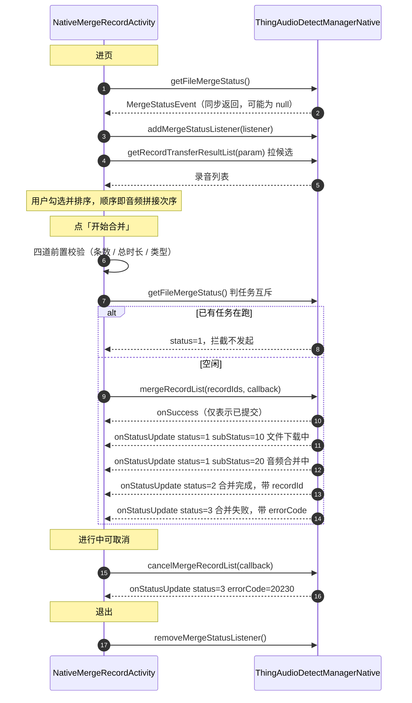

# 模块 8 · 合并录音

| 项 | 内容 |
|---|---|
| Demo 页面 | [`NativeMergeRecordActivity`](../../ai_voice/src/main/java/com/tuya/smart/ai_voice/nativeui/NativeMergeRecordActivity.java) |
| 全局约定 | [接入指南](./README.md) |

---

## 一、能力概述

把多条录音按选定顺序合并为一条新录音。典型场景是一场会议被中途打断分成了几段，
合并后当成一条完整录音去转写、总结。

合并结果是一条**全新**的录音记录，原有的几条**不会被删除**，需要的话由业务自行清理。

---

## 二、接口清单

| 方法 | 作用 | 回调 |
|---|---|---|
| `mergeRecordList` | 发起合并 | `IResultCallback` |
| `cancelMergeRecordList` | 取消进行中的合并 | `IResultCallback` |
| `getFileMergeStatus` | 查询合并状态快照 | **同步返回** `MergeStatusEvent` |

事件监听：`IMergeStatusListener`。

---

## 三、整体时序



> `status=2` 与 `status=3` 是互斥的终态，一次合并只会走到其中之一。

---

## 四、接口详解

### `mergeRecordList(List<String> recordIds, IResultCallback callback)`

发起合并。

| 参数 | 类型 | 必填 | 说明 |
|---|---|---|---|
| `recordIds` | `List<String>` | 是 | 业务 `recordId` 列表，**列表顺序即音频拼接次序**。2~10 条 |
| `callback` | `IResultCallback` | 否 | `onSuccess` 仅表示任务已提交，结果看 `IMergeStatusListener` |

> **入参是业务 `recordId`（`String`），不是 `recordTransferId`（`Long`）**——
> 与删除接口 `removeFileList` 用的 ID 类型不同，是最容易搞混的一处。

---

### `cancelMergeRecordList(IResultCallback callback)`

取消进行中的合并任务。

| 参数 | 类型 | 必填 | 说明 |
|---|---|---|---|
| `callback` | `IResultCallback` | 否 | 结果回调 |

取消后会收到 `onStatusUpdate`，`status == 3` 且 `errorCode == 20230`——
**这是取消的正常结果，不是失败**，界面不应按错误提示用户。

---

### `getFileMergeStatus()`

**同步返回** [`MergeStatusEvent`](#mergestatusevent)，无进行中任务时返回 `null`。

两个用途：

1. **进页取快照**——合并是后台任务，用户可能在合并中途切走再切回，
   不取快照界面就是空白，直到下一次事件到达
2. **发起前判互斥**——`status == 1` 说明上一个合并还没结束，此时应拦截。
   查询返回 `null` 可视为无任务、直接放行

---

### 事件监听 · `IMergeStatusListener`

```java
manager.addMergeStatusListener(listener);
manager.removeMergeStatusListener();   // 注意：无参
```

| 回调 | 说明 |
|---|---|
| `onStatusUpdate(MergeStatusEvent event)` | 合并进度与结果推送 |

> `removeMergeStatusListener()` **无参**，会移除**全部**已注册的合并监听。

---

## 五、数据结构

### `MergeStatusEvent`

`getFileMergeStatus` 的返回值，也是 `onStatusUpdate` 的回调参数。

| 字段 | 类型 | 说明 |
|---|---|---|
| `status` | `Int` | `0` 未开始 / `1` 执行中 / `2` 已完成 / `3` 异常 |
| `subStatus` | `Int?` | 执行中的子状态：`10` 文件下载中 / `20` 音频合并中 |
| `errorCode` | `Int?` | 错误码，`status == 3` 时有效 |
| `progress` | `Int?` | 进度 `0-100`，只在下载阶段有意义 |
| `recordId` | `String?` | 合并结果的 `recordId`，`status == 2` 时有值 |

---

## 六、关键约定

### 发起前的四道校验

底层不会替调用方兜住这些约束，**必须在客户端校验完再发起**：

| 约束 | 判据 | 提示 |
|---|---|---|
| 至少 2 条 | `recordIds.size() < 2` | 请至少选择 2 个文件 |
| 最多 10 条 | `recordIds.size() > 10` | 一次最多选择 10 个文件 |
| 总时长 ≤ 5 小时 | 各条 `duration` 之和 > `5 * 60 * 60 * 1000` | 合并总时长不能超过 5 小时 |
| 类型受限 | 含 `recordType == 2` 或 `3`（面对面 / 对话类） | 该类录音不支持合并 |

第五道是**任务互斥**，用 `getFileMergeStatus()` 判，见上。

### 进度映射要留出上限

合并阶段（`subStatus == 20`）不再上报细粒度进度，`progress` 只在下载阶段有意义。
直接用 `progress` 驱动进度条会先冲到 100% 再长时间停住：

| `subStatus` | 阶段 | 建议映射 |
|---|---|---|
| `10` | 文件下载中 | `min(progress, 90)` |
| `20` | 音频合并中 | 固定 `90` |
| — | `status == 2` 完成 | `100` |

---

## 七、错误码

`status == 3` 时的 `MergeStatusEvent.errorCode`：

| 码 | 含义 |
|---|---|
| `20220` | 参数错误，请重新选择文件后重试 |
| `20221` | 合并失败，请重试 |
| `20222` | 网络不可用，请检查网络后重试 |
| `20223` | 文件不存在，请检查文件后重试 |
| `20224` | 文件上传失败，请重试 |
| `20225` | 合并上报失败，请重试 |
| `20226` | 录音记录不存在，请重试 |
| `20227` | 未知错误，请重试 |
| `20229` | 合并文件创建失败，请重试 |
| `20230` | 合并已取消 |

> `20230` 是**主动取消**的结果，不是异常。调用 `cancelMergeRecordList` 后必然收到
> `status == 3` 且 `errorCode == 20230`，界面不应按失败提示用户。

---

## 八、接入清单

1. `addMergeStatusListener` / `removeMergeStatusListener` 成对注册与注销。
   **remove 无参**，会移除全部合并监听，多页面同时注册时需注意
2. 进页调一次 `getFileMergeStatus()` 取快照，补上进页前已在跑的任务
3. 发起前做完四道校验，再用 `getFileMergeStatus()` 判任务互斥
4. 入参传 `recordId`（`String`），**列表顺序即拼接次序**
5. `mergeRecordList` 的 `onSuccess` 只表示已提交，结果看 `IMergeStatusListener`
6. 进度按 `subStatus` 映射，下载阶段封顶 90%
7. `errorCode == 20230` 是主动取消，与真正的失败区别对待
8. 合并不会删除原录音，需要清理由业务自行调 `removeFileList`
