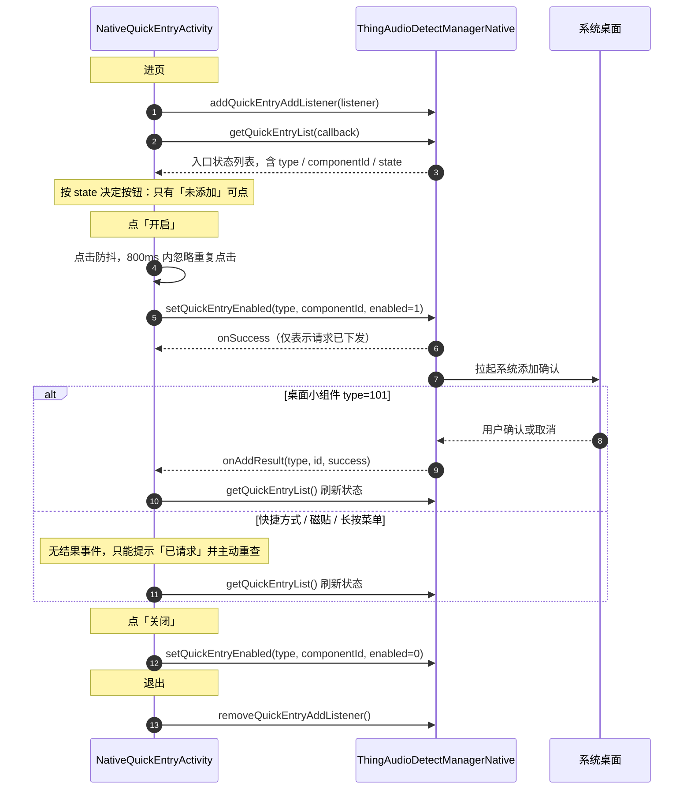

# 模块 9 · 分享 / 悬浮球 / 快捷入口

| 项 | 内容 |
|---|---|
| 快捷入口 Demo 页 | [`NativeQuickEntryActivity`](../../ai_voice/src/main/java/com/tuya/smart/ai_voice/nativeui/NativeQuickEntryActivity.java) |
| 分享链接 Demo 位置 | [`NativeRecordActionSheet`](../../ai_voice/src/main/java/com/tuya/smart/ai_voice/nativeui/NativeRecordActionSheet.java)（录音详情页「更多操作」） |
| 全局约定 | [接入指南](./README.md) |

---

## 一、能力概述

三件互不相关的事被归在同一个模块里，接入时按需取用：

| 能力 | 说明 | Demo |
|---|---|---|
| 录音分享链接 | 为某条录音生成 / 关闭对外分享链接 | 详情页「更多操作」 |
| 录音悬浮球 | 控制 App 内录音悬浮球的显隐 | **不实现** |
| 快捷入口 | 桌面小组件 / 快捷方式 / 磁贴的添加状态管理 | 独立页面 |

分享链接是「对某条录音的操作」，因此放在详情页而不是快捷入口页。

---

## 二、接口清单

| 方法 | 作用 | 回调 |
|---|---|---|
| `operateRecordShareLink` | 开启 / 关闭录音分享链接 | `IOperateRecordShareLinkResult` |
| `operateRecordingFloat` | 控制录音悬浮球显隐 | `IResultCallback` |
| `getQuickEntryList` | 查询各快捷入口的添加状态 | `IRecordCallBack<List<LauncherStateBean>>` |
| `setQuickEntryEnabled` | 开启 / 关闭指定入口 | `IResultCallback` |

事件监听：`IQuickEntryAddListener`。

---

## 三、分享链接

### `operateRecordShareLink(String recordId, List<String> shareType, long expireTime, int shareStatus, String password, IOperateRecordShareLinkResult callback)`

| 参数 | 类型 | 必填 | 说明 |
|---|---|---|---|
| `recordId` | `String` | 是 | 业务录音 ID（`String`），**不是 `recordTransferId`** |
| `shareType` | `List<String>` | 是 | 分享类型数组，链接分享传 `["link"]` |
| `expireTime` | `long` | 是 | **绝对**到期时间戳（毫秒），不是时长 |
| `shareStatus` | `int` | 是 | `1` 开启分享 / `2` 关闭分享 |
| `password` | `String` | 否 | 访问密码，传 `null` 表示不设密码 |
| `callback` | `IOperateRecordShareLinkResult` | 否 | `onSuccess(String link)` 返回链接地址 |

`onSuccess` 的 `link` 只在 `shareStatus == 1` 时有值；关闭分享时可能为空串。
关闭后原链接**立即失效**，再次开启会生成新链接。

```java
long expireTime = System.currentTimeMillis() + 7L * 24 * 60 * 60 * 1000;   // 7 天后到期
manager.operateRecordShareLink(recordId, Arrays.asList("link"), expireTime, 1, null, callback);
```

---

## 四、录音悬浮球

### `operateRecordingFloat(boolean isVisible, IResultCallback callback)`

| 参数 | 类型 | 必填 | 说明 |
|---|---|---|---|
| `isVisible` | `boolean` | 是 | `true` 显示 / `false` 隐藏 |
| `callback` | `IResultCallback` | 否 | 结果回调 |

悬浮球的样式与点击行为由 SDK 内部提供，接入方只能控制显隐。
**本 Demo 不实现**——它属于宿主 App 的全局交互，与单个演示页的生命周期不匹配。

---

## 五、快捷入口

管理录音功能在桌面上的入口：桌面小组件、桌面快捷方式、下拉磁贴、图标长按菜单。

> 这些组件需宿主 App 事先注册（AppWidget、Shortcut、QuickSettings Tile）。
> 本 Demo 工程未注册任何此类组件，`getQuickEntryList` 返回空列表或全部「不显示添加」属正常。

### 整体时序



### `getQuickEntryList(IRecordCallBack<List<LauncherStateBean>> callback)`

| 参数 | 类型 | 必填 | 说明 |
|---|---|---|---|
| `callback` | `IRecordCallBack<List<LauncherStateBean>>` | 否 | 返回 [`LauncherStateBean`](#launcherstatebean) 列表，可能为空 |

### `setQuickEntryEnabled(int type, int componentId, int enabled, IResultCallback callback)`

| 参数 | 类型 | 必填 | 说明 |
|---|---|---|---|
| `type` | `int` | 是 | 组件类型，取值见下表 |
| `componentId` | `int` | 是 | 组件 ID，**必须与 `type` 配套**，从 `LauncherStateBean` 取 |
| `enabled` | `int` | 是 | `1` 开启 / `0` 关闭。**传其他值会被判为参数错误** |
| `callback` | `IResultCallback` | 否 | `onSuccess` 仅表示请求已下发 |

**`type` 与 `componentId` 的配套关系**

| `type` | 含义 | 对应 `componentId` |
|---|---|---|
| `101` | 桌面小组件 | `10101` 组件 1×1、`10102` 组件 2×2 |
| `102` | 桌面快捷方式 | `10201` |
| `103` | 下拉磁贴 | `10301` |
| `104` | 图标长按菜单 | `10401` |

> `componentId` 是 5 位数（`10101` 而非 `1`），从 `LauncherStateBean.getId().getId()` 取，
> 不要自己拼。

### 事件监听 · `IQuickEntryAddListener`

```java
manager.addQuickEntryAddListener(listener);
manager.removeQuickEntryAddListener();   // 注意：无参
```

| 回调 | 说明 |
|---|---|
| `onAddResult(int type, int id, boolean success)` | 添加结果。**只有 `type == 101` 会触发** |

---

## 六、数据结构

### `LauncherStateBean`

| 字段 | 类型 | 说明 |
|---|---|---|
| `type` | `Int` | 组件类型：`101` / `102` / `103` / `104` |
| `id` | `RecordLauncherId` | 组件 ID 枚举，取数值用 `getId().getId()` |
| `state` | `ComponentAddState` | 添加状态，取值见下 |

**`ComponentAddState` 取值**

| 值 | 名称 | 含义 | 界面处理 |
|---|---|---|---|
| `0` | `HIDE_ADD` | 不显示添加 | 当前系统不支持由 App 发起添加，**禁用「开启」**，改为引导手动添加 |
| `1` | `ADDED` | 已添加 | 禁用「开启」，避免重复拉起系统弹窗 |
| `2` | `NOT_ADDED` | 未添加 | 可点「开启」 |

> `0` 与 `2` 都是「尚未添加」，但含义完全不同：`0` 是**系统不允许程序化添加**
> （部分 ROM / 系统版本），此时按钮点了也没用；`2` 才是可以发起。
> 二者混为一谈会让用户反复点击无反应。

---

## 七、关键约定

### `onSuccess` 不代表添加成功

`setQuickEntryEnabled` 的 `onSuccess` 只表示请求已下发，系统的添加确认弹窗还没弹。
最终结果：

| 类型 | 结果来源 |
|---|---|
| `101` 桌面小组件 | `onAddResult(type, id, success)` |
| `102` / `103` / `104` | **没有结果事件**，只能提示「已请求」并主动 `getQuickEntryList()` 重查 |

`onAddResult` 本身不携带最新的 `state`，收到后要重新调 `getQuickEntryList()` 刷新。

### 加点击防抖

开启会拉起系统的添加确认弹窗，连点会重复拉起。建议锁定约 800ms，
或在收到 `onAddResult` / 重查完成后再释放。

---

## 八、错误码

**本模块没有专属数字错误码**，失败信号有两条：

| 信号 | 含义 | 处理 |
|---|---|---|
| `setQuickEntryEnabled` 的 `onError(code, error)` | 请求未能下发（含 `enabled` 非 `0`/`1` 的参数错误） | 提示失败，释放点击锁 |
| `onAddResult` 中 `success == false` | 请求已下发，但用户取消或系统拒绝 | 提示添加失败 |

`operateRecordShareLink` 与 `operateRecordingFloat` 同样走通用 `onError`，
`code` 为底层透传，不建议据此做分支逻辑。

---

## 九、接入清单

1. `addQuickEntryAddListener` / `removeQuickEntryAddListener` 成对注册与注销。
   **remove 无参**，会移除全部监听，多页面同时注册时需注意
2. 进页调 `getQuickEntryList()`，**按 `state` 决定按钮可用性**，三态给不同交互
3. **加点击防抖**（建议 800ms），开启会拉起系统弹窗
4. `type` 与 `componentId` 配套传，`componentId` 从返回的 bean 取，不要自己拼
5. `enabled` 只能传 `1` 或 `0`
6. 只有 `type == 101` 会回调 `onAddResult`，其余类型需主动重查
7. `onAddResult` 后重新 `getQuickEntryList()` 刷新，它本身不带最新 `state`
8. 分享链接的 `expireTime` 是**绝对时间戳**，不是时长；`recordId` 是 `String`
